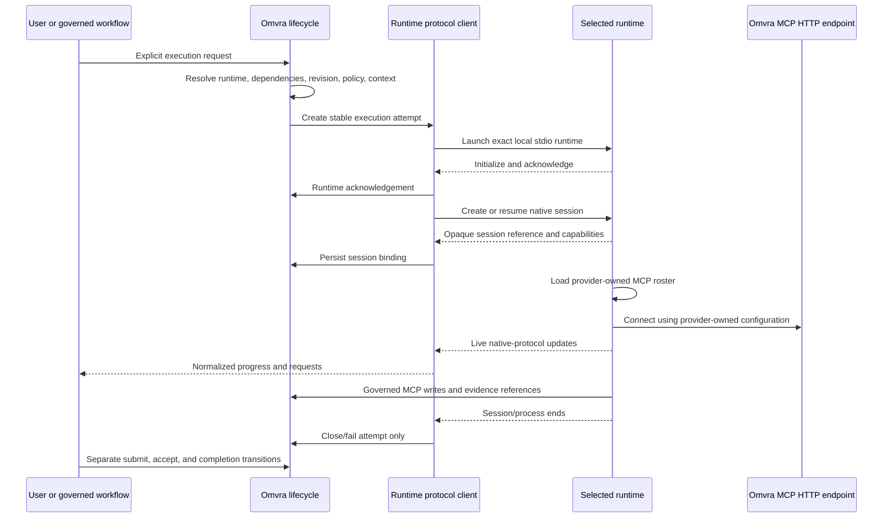

# ACP runtime, session binding, and lifecycle contract

Status: proposed architecture for human acceptance  
Decision date: 2026-07-29  
Task: `task-e245b4ab-1b7c-48c9-9742-58c448c5aa9c`

## Summary

Add local agent runtimes as protocol-specific clients inside the existing Electron modular monolith. Omvra agent identity, installed runtime, protocol, and model provider remain separate. Runtime selection is deterministic and visible. Session bindings live in a separate versioned store and correlate one runtime-owned opaque session reference with one stable Omvra execution attempt.

ACP owns live interaction. Existing task collaboration, Goal lifecycle, context ledger, evidence, revision, acceptance, archive, backup, and audit contracts remain authoritative. A session ending never submits, accepts, completes, archives, or abandons Omvra work.

The first release supports explicitly configured local stdio runtimes using native ACP, native Codex app-server, or native Claude stream-json, plus a user-invoked external handoff. Omvra launches the installed runtime directly; it does not require a separately installed protocol-conversion executable. Generic ACP profiles remain application-neutral: any conforming runtime can be configured with its exact executable and fixed launch arguments, including OpenCode with `acp`. Stdio is a locality and process-lifecycle choice, not a single-agent restriction: Omvra may coordinate multiple concurrent sessions in one capable runtime and/or multiple explicitly started runtime subprocesses. Distributed runtime pools and remote transports remain deferred.

Agent-runtime and MCP transports are independent. ACP, Codex app-server, or Claude stream-json carries runtime/session control over local stdio; MCP carries governed Omvra reads and writes over Omvra's configured HTTP endpoint. The selected runtime is authoritative for its general MCP registry and provider credentials. Omvra exposes only its own endpoint and may attach a session-scoped Omvra grant when a provider adapter requires explicit connection material. This grant does not copy, disable, or replace the provider's other MCP entries. Authentication remains owned by the selected runtime and Omvra does not collect provider credentials. Codex exposes authentication during model-free preflight through `account/read`; Claude authentication remains `unknown` until an explicitly started session reports it because its CLI exposes no model-free authentication handshake. The release does not add automatic spawning, watcher dispatch, remote gateways, arbitrary runtime plugins, or silent failover.

## Decision drivers

### Verified facts

- Task collaboration already has stable contribution and execution-attempt IDs, distinct attempt/contribution/task lifecycle states, and separate append-only event history.
- Runtime, session, transcript, credential, and usage fields are rejected from the task collaboration projection.
- Goal execution already owns acknowledgement, dispatch, retry, evidence, acceptance, and completion independently of any provider session.
- `resolveTaskExecutionContext` is the canonical provider-neutral task contract used by managed sessions, `agent.resolve_task_context`, and assigned `tasks.get` reads; the task-context ledger is the bounded, source-linked portability seam.
- MCP transports and runtime protocol clients must remain separate adapters over the domain layer.
- Codex, Claude, and conforming ACP runtimes own the MCP configuration they expose to their sessions; Omvra owns only its endpoint and governed tool behavior.
- MCP audit records are bounded and redacted. Workspace backup/restore preserves versioned workspace records and unknown fields.

### Constraints

- Preserve legacy/direct task execution when no runtime or session record exists.
- Preserve `__mcpRevision`, collaboration attempt identity, Goal revisions, public MCP contracts, and current storage keys.
- Store no provider credentials, raw prompts, raw responses, raw tool payloads, hidden reasoning, or full transcripts.
- Do not place MCP credentials in prompts, task records, launch arguments, general audit, or provider-owned session metadata.
- Do not infer unsupported ACP capabilities or missing token/cost values.

## Universal task execution contract

Managed runtime sessions and direct MCP consumers use the same resolution and composition order:

1. resolve the exact task id and its minimal assignment metadata;
2. resolve the exact assigned agent, if any;
3. apply available behavioural and operational persona instructions;
4. classify skill references by the authority that can observe them without installing anything or widening permissions;
5. present Omvra-resolved instructions, runtime-advertised availability, and provider-runtime checks as distinct states;
6. present the authoritative task instructions and bounded task-context history;
7. execute and report any degraded profile or skill fallback in task resolution notes and the final handoff.

The contract guarantees delivery and ordering, not provider-internal semantic obedience. Persona and skill content remain user-authored workspace guidance below system, developer, security, permission, sandbox, tool, and task-acceptance constraints. A missing task is a hard stop. An unassigned task or absent/incomplete persona uses standard allowed agentic behaviour. Runtime-confirmed missing or permission-denied skills do not alone block task completion: the agent uses an allowed substitute where possible and reports the skill, fallback, and likely impact. It must never install a skill or broaden access unless the user separately requests that action.

### Skill authority and location

The same skill id may exist in different locations. Availability is always scoped to an authority; absence from one catalogue is not evidence about another:

| Authority | Location and observer | Contract resolution | Effect on fidelity |
| --- | --- | --- | --- |
| `omvra-managed` | Omvra bundled/configured skill roots; Omvra can read trust, integrity, and content | `resolved`, or rejected for Omvra-governed use | Resolved content is included; rejected content is never loaded |
| `runtime-advertised` | A selected ACP/runtime explicitly reports the skill or a permission decision | `runtime-available`, `runtime-missing`, or `provider-permission-denied` | Confirmed missing/denied degrades fidelity and requires fallback notes |
| `provider-runtime` | Codex, Claude, or organization-managed private catalogues that Omvra cannot inspect | `runtime-unverified` until the consumer checks locally | Does not degrade fidelity; lack of Omvra visibility is not unavailability |

Persona operational instructions are portable best-effort references. A bare reference resolves from a trusted Omvra catalogue when possible. Otherwise Omvra returns `provider-runtime / runtime-unverified` and tells the consumer to use the skill if its native runtime provides it. Only the runtime can turn that state into confirmed available, missing, or permission-denied. Omvra does not inspect provider-private directories and does not reinterpret an untrusted Omvra candidate as proof that the provider-native skill is denied.

Goal requirements use a separate strict contract. A pre-dispatch requirement must resolve from an Omvra-managed catalogue or explicit runtime advertisement; an unverifiable provider-private reference cannot satisfy a required Goal capability. This strict Goal rule does not convert portable persona references into blocking requirements.

`tasks.get` automatically exposes this contract with the task so copying a task id into a direct MCP-capable client does not create a weaker persona path. `agent.resolve_task_context` exposes the same structured result explicitly. Managed start, continue, and resume prompts rebuild it from current workspace state. Full persona, prompt, and skill bodies are composed on demand and are not persisted in attempts, session events, audit records, or backups.
- Keep one Electron deployment and one workspace. No service split or plugin framework is justified.

### Quality goals

- Deterministic runtime selection with visible, explicit failure.
- Provider-portable work context without transcript replay.
- Crash and close behavior that cannot silently change durable work state.
- Bounded, privacy-safe persistence and audit.
- Backward-compatible delivery in small, independently testable phases.

## Architecture options

| Option | Structure | Benefits | Costs and risks | Conditions |
| --- | --- | --- | --- | --- |
| Keep runtime/session data on collaboration, Goal nodes, or tasks | Add provider fields to current projections | Smallest initial lookup path | Couples identity to runtime, leaks runtime concerns into durable work, grows current records, conflicts with existing validation | Rejected |
| Separate runtime profiles and session bindings behind in-process protocol clients | New versioned records; native ACP, Codex, and Claude clients call existing task/Goal/context/evidence domains | Preserves ownership, supports multiple runtimes without external conversion tools, bounded migration, reuses current deployment | Requires correlated writes, explicit recovery, and maintained protocol-specific clients | **Selected** |
| Separate runtime service or arbitrary plugin host | New process/service owns runtime profiles and sessions | Strong isolation and extension flexibility | Adds authentication, synchronization, deployment, and plugin security cost before a demonstrated need | Rejected for the first release |

The selected option uses local stdio because Omvra owns the child process and can correlate launch, exit, crash, cancellation, and cleanup without opening a listening endpoint. ACP-capable runtimes use ACP directly; OpenCode is the first verified generic example through `opencode acp`. Codex uses `codex app-server --stdio`, while Claude uses `claude -p --input-format stream-json --output-format stream-json --verbose`. Omvra speaks each native protocol directly and does not route either application through a conversion executable. HTTP or WebSocket becomes useful when a runtime must live on another machine, be shared independently of the desktop process, or scale as a distributed pool. No transport supplies orchestration: Omvra remains responsible for delegation, concurrency, dependencies, evidence, retries, budgets, and acceptance.

## Recommendation

Use separate in-process protocol clients and versioned records. This is the smallest design that connects directly to installed runtimes without binding personas to providers or requiring external conversion tools, while preserving the existing domain authority and deployment model. Reconsider process isolation only if a supported remote runtime, untrusted third-party runtime, or independently deployed execution tier creates a demonstrated isolation requirement.

## Evidence versus assumptions

Evidence: current collaboration validation already excludes runtime data; stable attempt IDs and lifecycle transitions exist; Goal policy/evidence and MCP audit boundaries are implemented; Electron main-process composition already hosts local protocol adapters.

Assumptions to validate during each protocol-client spike: the runtime exposes stable initialization/capability behavior, its opaque session reference can be restored reliably, and process-level interruption can be distinguished from an acknowledged cancellation. Codex app-server schemas and Claude stream-json messages are version-specific, so the installed executable remains the source of truth. Failure of any assumption narrows resume or capability support; it does not justify simulated behavior or silent fallback.

## Identity and ownership boundaries

| Concept | Owner | Durable meaning |
| --- | --- | --- |
| Omvra agent identity | Person/task/Goal contracts | Persona, instructions, assignment, contribution role, and accountability |
| Runtime profile | Agent runtime configuration | One exact installed application, native protocol, and launch method |
| Model provider | External runtime, observed by Omvra when reported | Authentication, billing, provider limits, and model access |
| Execution attempt | Task collaboration or Goal lifecycle | One governed attempt to perform a bounded work scope |
| ACP session binding | ACP adapter store | Correlation between one execution attempt and one runtime-owned session |
| Context checkpoint | Task-context or Goal evidence contracts | Provider-portable durable work history |

No identity implies another. Assigning Arc, Codex, or any other Omvra persona does not choose a runtime or provider. Changing a runtime does not transfer task ownership, contribution identity, Goal-node ownership, or acceptance authority.

## Runtime profile and resolution contract

Runtime profiles are stored separately under `omvra.agentRuntimeProfiles.v1`. Defaults are workspace settings, not person fields.

```ts
type RuntimeIntegrationMode = 'external-handoff' | 'acp-local-stdio' | 'claude-stream-json-stdio' | 'codex-app-server-stdio';

interface AgentRuntimeProfileV1 {
  schemaVersion: 1;
  id: string;
  name: string;
  integrationMode: RuntimeIntegrationMode;
  executablePath?: string;
  fixedArgs?: string[];
  externalUrlScheme?: string;
  enabled: boolean;
  createdAt: string;
  updatedAt: string;
}

interface AgentRuntimeDefaultsV1 {
  schemaVersion: 1;
  globalRuntimeProfileId?: string;
  projectRuntimeProfileIds: Record<string, string>;
}
```

The profile contains launch configuration only. Provider name, implementation/version, model/mode, capabilities, availability, authentication state, and usage are runtime observations. Credentials, tokens, cookies, provider account IDs, and billing instruments are forbidden.

Runtime resolution uses exactly this order:

1. execution request override;
2. project default for the work scope;
3. global default.

Resolution returns the selected profile ID and source (`execution`, `project`, or `global`). If no profile resolves, or the selected profile is disabled, missing, incompatible, unavailable, or requires authentication, preflight fails visibly. Omvra does not try the next default and does not substitute another runtime. A user may explicitly choose a different profile or invoke external handoff.

Connection testing launches the exact executable and argument array without shell interpolation, performs ACP initialization plus capability/authentication discovery, then terminates without creating an execution attempt, session, or model turn.

### Working-directory resolution

The runtime working directory is execution-scope metadata, not a global connection setting and not part of a runtime profile. A single manually entered workspace path would incorrectly assume that an agent works in only one project.

The working-directory model is:

1. **Swimlane information** may define a repository folder as the default working directory for tasks in that swimlane.
2. A task may define an optional repository-folder override when its work belongs elsewhere.
3. A global working location may be configured as a cross-project fallback. It participates only in working-directory resolution and never filters projects or task lists.
4. Preflight resolves the task override first, then the swimlane/project default, then the global location. If none is configured, Omvra creates an isolated app-managed scratch workspace for that task; it does not guess, scan the filesystem, or reuse a folder from another task.
5. The task execution surface shows the resolved folder and whether it came from the task, project, global location, or scratch workspace before starting the runtime.
6. One execution/session retains one primary working directory. An agent may cycle through projects by starting or resuming each task in its independently resolved directory; Omvra does not silently change the directory of a live session.

Additional repository folders for one task are deferred until a demonstrated multi-repository workflow requires them. If added, they must be explicit allowed roots rather than an implicit search scope. The current global `workspacePath` connection input is therefore transitional and should be removed when this resolution model is implemented, not merely renamed.

## Runtime observation and capability contract

Observations are refreshed during connection and session preflight. Persist only the latest bounded observation plus normalized session events.

```ts
type RuntimeAvailability = 'available' | 'unavailable' | 'unknown';
type RuntimeAuthentication = 'authenticated' | 'required' | 'unknown';
type CapabilitySupport = 'supported' | 'unsupported' | 'unknown';

interface RuntimeCapabilityObservationV1 {
  id: string;
  support: CapabilitySupport;
  version?: string;
}

interface RuntimeObservationV1 {
  runtimeProfileId: string;
  implementationName?: string;
  adapterVersion?: string;
  providerName?: string;
  modelOrMode?: string;
  availability: RuntimeAvailability;
  authentication: RuntimeAuthentication;
  capabilities: RuntimeCapabilityObservationV1[];
  observedAt: string;
}
```

`unknown` is distinct from `unsupported`, and missing usage is distinct from zero. A control may execute only when its required capability is `supported`. `unsupported` or `unknown` fails with a visible normalized capability error; Omvra never simulates the operation or silently uses a different mechanism.

Provider-reported tokens, context usage, and cost are optional observations labelled `reported`. They may support warnings or bounded cancellation policy, but Omvra does not claim that they equal the provider bill.

## Session binding contract

### 2026-08 lifecycle audit and decision

Verified ownership before this change: `agent-runtime-session-service.cjs` persisted binding state and normalized events; `agent-runtime-session-runner.cjs` owned live clients, pending requests, provider notifications, cancellation, and task-execution synchronization; task attempts persisted `runtimeExecution`; renderer supervision, milestone launch, and status surfaces each interpreted binding state independently. Pending-request controls remain because they close real interaction gaps; Omvra-specific MCP auto-approval was removed with configuration injection so provider permission handling remains authoritative. Binding-state-derived work labels consume the canonical turn projection.

| Option | Benefit | Cost or disqualifier | Decision |
| --- | --- | --- | --- |
| Keep overloaded binding states and add renderer guards | Lowest immediate diff | Preserves contradictory owners and makes every new surface repeat lifecycle inference | Rejected |
| Put all turn state only on task attempts | Reuses task persistence | Cannot represent Goal-node turns or provide one provider-neutral blocker projection | Rejected |
| Add the latest turn projection to the existing binding and mirror task attempts | Reuses the binding, event, IPC, and task-attempt contracts; covers task and Goal scopes | Adds one optional backward-compatible binding field and coordinated writes | Selected |
| Add a new turn store/event bus | Strong separation on paper | Unproven operational need, migration and backup cost, duplicate correlation | Rejected by YAGNI |

Store bindings separately under `omvra.acpSessionBindings.v1`. Current task, collaboration, and editable Goal graph records contain at most a `sessionBindingId` correlation field on their stable execution-attempt record. They never contain the opaque session reference.

```ts
type AcpSessionState =
  | 'starting'
  | 'ready'
  | 'interrupted'
  | 'closed'
  | 'failed';

type AcpTaskTurnState =
  | 'queued'
  | 'starting'
  | 'active'
  | 'waiting-input'
  | 'cancelling'
  | 'completed'
  | 'failed'
  | 'interrupted';

interface AcpTaskTurnProjectionV1 {
  schemaVersion: 1;
  id: string;
  state: AcpTaskTurnState;
  createdAt: string;
  updatedAt: string;
  startedAt?: string;
  finishedAt?: string;
  requestId?: string;
  terminalReason?: string;
}

type AcpWorkScopeV1 =
  | {
      kind: 'task';
      taskId: string;
      contributionId?: string;
      executionAttemptId: string;
      taskRevision: number;
    }
  | {
      kind: 'goal-node';
      goalId: string;
      goalElementId: string;
      goalExecutionId: string;
      executionAttempt: number;
      goalRevision: number;
    };

interface AcpSessionBindingV1 {
  schemaVersion: 1;
  id: string;
  runtimeProfileId: string;
  scope: AcpWorkScopeV1;
  opaqueSessionRef?: string;
  state: AcpSessionState;
  turn?: AcpTaskTurnProjectionV1;
  capabilities: RuntimeCapabilityObservationV1[];
  createdAt: string;
  updatedAt: string;
  lastObservedAt: string;
  terminalReason?: 'closed' | 'cancelled' | 'process-exit' | 'runtime-missing' | 'protocol-error';
  closedAt?: string;
}
```

The runner/main process is the sole transition owner. `sessions/list` returns this combined projection through the existing IPC/preload boundary; renderers may format it but may not derive work state from task status, binding state, and event history.

Binding and turn invariants:

- One binding references exactly one runtime profile and one task or Goal-node execution attempt.
- A `ready` binding is a connected reusable provider session and does not mean an agent is working.
- “Agent is working” means the binding has an in-flight turn (`queued`, `starting`, `active`, `waiting-input`, or `cancelling`).
- One binding has at most one in-flight turn. A terminal turn cannot be resurrected; a later batch receives a new turn ID.
- An in-flight turn is correlated to its task/contribution attempt or immutable Goal-node execution through the binding scope. Goal acceptance remains separate.
- A connected or resumable binding requires `opaqueSessionRef`; terminal retention may clear it without deleting the binding record.
- Pending input is addressable only by binding ID, turn ID, and provider request ID. Routine policy-approved tool permission requests remain permission events and do not enter `waiting-input`.
- `opaqueSessionRef` is a runtime-owned correlation token, not an agent identity, credential, transcript locator, acceptance signal, or authority grant.
- Legacy `mcpGrantId` fields are preserved as unknown migration data but are not written, consumed, or revoked by the runtime runner.
- The captured task/Goal revision identifies the context used to start the session. A later revision marks the session context stale; it does not roll back the work record or authorize overwriting the newer revision.
- Every governed write still supplies the current task or Goal revision. The adapter cannot bypass optimistic concurrency.
- Capabilities are a start-time snapshot for reproducibility. Current controls also consult the latest observation and fail if support is no longer available.
- Bindings preserve unknown fields across backup/restore and no-op migration.

### Transition and concurrency policy

| Owner | From | To | Trigger |
| --- | --- | --- | --- |
| Runner | session absent | `starting` | explicit task or Goal launch after preflight |
| Runner | `starting` | `ready` | provider session negotiated and live |
| Runner | `starting`/`ready` | `interrupted` | missing client, process exit, transport loss, or shutdown |
| Runner | `starting`/`ready` | `failed` | unrecoverable protocol/start failure |
| Runner | `ready` | `closed` | explicit close or bounded automatic retirement |
| Runner | no turn/terminal turn | `queued`/`starting` | prompt accepted for dispatch |
| Runner | `queued`/`starting` | `active` | provider turn-start observation |
| Runner | `active` | `waiting-input` | genuine structured elicitation with concrete request correlation |
| Runner | `waiting-input` | `active` | matching response sent |
| Runner | in-flight | `cancelling` | explicit cancellation |
| Runner | in-flight | `completed`/`failed`/`interrupted` | one matching terminal outcome, cancellation settlement, timeout, or provider loss |

Current policy is one in-flight turn across the workspace, one in-flight turn per runtime session, and one in-flight turn per task/Goal execution scope. Idle `ready` sessions do not consume that capacity. Before duplicate-start validation, the runner reconciles persisted bindings against its live client/process registry. Rejection identifies the exact blocking binding, task/Goal scope, and turn ID before another prompt or process is spawned.

Durable task context appended during a turn is queued for the next task turn by default because every new prompt rebuilds the bounded authoritative context pack. Explicit live guidance uses `steer` only when the negotiated provider capability supports it; otherwise the UI leaves the guidance unsent and requires a follow-up turn. Omvra does not inject changing task records into an active provider turn implicitly.

The existing task attempt `runtimeExecution` remains a compatibility mirror for task status/evidence surfaces. The binding `turn` projection is necessary because Goal-node turns and cross-surface concurrency cannot be represented by task attempts alone. No new store or event bus is introduced.

## Provider-owned MCP configuration contract

Starting or resuming a runtime session does not create or own the provider's general MCP registry. Codex, Claude, or another ACP runtime otherwise loads the same MCP roster it would use when launched directly. Where a provider has no inherited way to receive Omvra's endpoint, its adapter may pass a bounded Omvra-only connection entry and session-scoped bearer grant. No provider credential is included, and the grant is limited to the bound execution scope.

Omvra remains responsible for:

- starting and exposing its configured HTTP MCP listener;
- enforcing the normal workspace capability, revision, policy, evidence, audit, and acceptance contracts on each tool call;
- reporting provider MCP startup and tool events as observations without treating unrelated server failures as an Omvra task-start failure.

If the provider cannot accept either its existing Omvra entry or the adapter's scoped Omvra grant, Omvra reports the observed limitation. It never manufactures a second general registry, substitutes a dev endpoint, or broadens credentials. External handoff receives no Omvra-generated MCP configuration.

## Lifecycle contract

The following facts are distinct and must have distinct event types and owners:

| Fact | Durable owner | Effect |
| --- | --- | --- |
| External handoff prepared/opened | Runtime handoff audit plus optional handed-off attempt | No ACP session; no proof of model execution; no contribution/task/Goal advancement |
| Runtime acknowledged | Existing task/Goal attempt lifecycle | Runtime accepted the work request; may enter acknowledged/working according to that lifecycle |
| ACP session started or resumed | ACP binding/event store | Creates or reactivates one binding; does not submit or accept work |
| Live progress, plan, tool, permission, or input update | Bounded ACP event stream | Presentation/steering only; never authoritative task or Goal state |
| Runtime process completed | Execution attempt lifecycle | Attempt may become `completed`; contribution, Goal output, and task status are unchanged |
| Contribution submitted | Task collaboration lifecycle | Requires durable evidence; becomes `submitted`, not accepted |
| Contribution accepted | Task collaboration lifecycle | Orchestrator accepts evidence; aggregate task remains separate |
| Goal evidence/handoff accepted | Goal lifecycle | Advances only through existing governed Goal commands and gates |
| Aggregate review/completion | Task status/human review or Goal delivery lifecycle | Existing acceptance authority remains required |



## Closure, crash, resume, cancellation, and missing runtime

- **Explicit close:** terminalize any in-flight turn once, mark the provider session `closed`, and preserve durable Omvra state. Closing cannot submit, accept, complete, delete, archive, or abandon work.
- **Normal process exit:** record the observed exit and mark the attempt `completed` only when the existing lifecycle permits it. Contribution/task/Goal state does not advance automatically.
- **Crash or lost transport:** mark any in-flight turn `interrupted`, then mark the provider session `interrupted`. Keep the work scope and checkpoint available and release execution capacity.
- **Resume:** allowed only with the same runtime profile when session-resume capability is `supported` and the opaque reference remains valid. Otherwise the user starts a new execution attempt and receives the latest accepted Omvra context pack.
- **Cancellation:** move the turn, not the session, to `cancelling`; issue the selected protocol's cancel operation only when supported and wait for acknowledgement. A timeout makes the turn `interrupted`; the reusable provider session remains `ready` when transport liveness is intact.
- **Missing or unavailable runtime:** fail before session creation. Do not create a fabricated session, background retry, or fallback attempt. External handoff remains a separate explicit action.
- **Authentication required:** surface the runtime-provided method or agent-native sign-in instruction. Omvra never receives or persists the credential.
- **Provider MCP unavailable:** keep the runtime session visible, report the provider observation, and do not inject a substitute configuration. The session cannot claim governed Omvra work succeeded without durable Omvra evidence.
- **Stale work revision:** keep the session visible as stale, require context refresh, and let the normal revision contract reject stale writes.

Active and interrupted bindings retain the opaque reference so a supported resume is possible. Explicitly closed, cancelled, or archived bindings retain normalized metadata and correlation IDs but remove the opaque reference. In the first release, normalized terminal bindings and events remain with the workspace until the workspace is deleted; reads stay bounded. There is no background retention job. A later configurable expiry policy may shorten that metadata retention without restoring or extending session resumability.

## Local-stdio first-release boundary

- Native ACP, Codex app-server, and Claude stream-json clients run in the Electron main process behind the existing domain facades; none is a domain dependency or imports MCP internals.
- Codex profiles launch the configured Codex executable with `app-server --stdio`. Omvra speaks Codex JSONL directly, sends `initialize`/`initialized`, and observes existing authentication with `account/read`; no Codex-to-ACP executable is installed or invoked.
- Claude profiles launch the configured Claude executable in print-mode stream-json input/output. Model-free preflight validates that the exact executable advertises the required flags without sending a user message; version, session initialization, and authentication are observed only after an explicit execution request.
- Generic ACP profiles accept any conforming executable and fixed arguments. OpenCode uses its installed executable with `acp`; its advertised ACP version, capabilities, and authentication methods are handled by the same generic client.
- Launch requires an explicit user or already-governed Goal action. Assignment, delegation eligibility, watcher changes, and board polling cannot launch it.
- The executable path is exact, fixed arguments are an array, the workspace directory is validated, and no shell interpolation is used.
- Only the selected runtime receives the bounded execution contract. Provider MCP configuration remains unchanged except for an adapter-required, Omvra-only scoped grant.
- The first migrated policy permits one in-flight task/Goal turn across the workspace while allowing multiple idle reusable sessions. Per-runtime multiplexing is deferred until a provider-neutral advertised-capacity contract exists. Join behavior is based on accepted durable outputs, never shared transcripts or session proximity.
- This is local multi-agent execution, not a remote/shared agent pool. Remote ACP over HTTP/WebSocket may later expand deployment location and independent scaling without changing the collaboration, session-binding, provider-owned MCP, or acceptance contracts.
- Remote gateways, hosted agents, Omvra-owned provider credentials, provider SDKs, arbitrary runtime/plugin installation, recursive agent trees, background relaunch, and silent runtime failover are out of scope.
- `Open externally` uses an allowlisted application link or exact executable handoff. It records `external-handoff` only, creates no ACP binding or MCP configuration, does not prove authentication or execution, and does not change task/Goal status. The UI should describe this as opening/preparing work externally, not starting or sending an ACP session.

## Alignment with existing Omvra contracts

### Collaboration and task status

Task collaboration attempts may add `sessionBindingId`; task and collaboration projections continue to reject runtime/session payloads. Attempt completion and session closure do not change contribution state or aggregate task status. Submission requires evidence and acceptance remains orchestrator/human governed.

### Goal lifecycle

The editable Goal graph stores no session. A binding references the immutable Goal execution ID, agent-node ID, attempt number, and Goal revision. Dispatch, acknowledgement, retry, pause, evidence, handoff, approval, and completion remain Goal lifecycle commands.

### Context ledger and evidence

ACP receives the latest accepted checkpoint and bounded history index from Omvra. Live transcripts and tool payloads are not copied into the ledger. Only concise source-linked decisions, blockers, evidence, handoffs, and checkpoints are appended. Agent-authored entries cannot represent human acceptance.

### Audit and telemetry

Use a bounded ACP session-event stream correlated by binding ID, runtime profile ID, work-scope IDs, and attempt ID. Audit records omit `opaqueSessionRef`, prompts, responses, transcripts, tool payloads, credentials, evidence bodies, and hidden reasoning. Usage/cost fields retain missing-versus-zero semantics and a `provider-reported` provenance label.

Native runtime events remain separate from `omvra.mcp.audit.v1`. Every stored event identifies its normalized kind, native protocol and event type, binding, runtime profile, task/contribution or Goal-node scope, execution attempt, source revision, observed time, and bounded outcome/capability facts. Protocol-specific events that have no shared semantic remain `unsupported-event`; they are not relabelled as ACP events. Permission records retain only request correlation, capability ID, `requested|allowed|denied|cancelled|unknown`, and `authority: runtime-provider`. They do not represent Omvra scope approval, evidence acceptance, destructive-operation consent, or budget widening.

Usage records are optional provider reports. Each declares `aggregation: cumulative|delta|unknown`; only cumulative values or complete delta series may be compared with a threshold. Missing, delayed, or aggregation-unknown usage remains unknown rather than becoming zero. Context usage, input/output/total tokens, cost, and currency are independent optional fields, and no projection claims to predict or guarantee the provider's final bill.

The session domain evaluates wall-time, turn, tool-call, workspace concurrency, work-scope attempt, reported-token, and reported-cost thresholds. Each configured threshold returns `allow`, `warn`, `pause`, or `cancel`; reported token/cost thresholds default to warning, while a caller must opt into stronger action. Missing or delayed provider usage may warn or pause, never cancel by default. A governance decision is advisory to the runtime controller and cannot mutate task/Goal acceptance state. Pause/cancel results set no automatic retry, so the same threshold cannot create a retry loop.

Every native runtime event and runtime-authored context outcome carries a non-dispatchable origin marker tied to its execution attempt. Watchers and future automatic-dispatch policy must suppress this causal chain. A human-authored later revision may steer or pause the existing session, but storing an event, usage report, permission fact, or agent-authored checkpoint never launches another attempt.

### Archive, backup, and restore

- Archiving is blocked while a provider session is `starting` or its turn is in flight. An idle `ready` session may be explicitly closed as part of archive preparation.
- The user must cancel/close an in-flight turn or explicitly resolve an interrupted attempt first.
- Archive cleanup removes resumability by clearing the opaque reference while preserving normalized metadata, context, evidence, lifecycle, and audit history.
- Restoring archived work starts from a durable Omvra checkpoint; it never silently resumes a provider session.
- Workspace backup/restore includes runtime profiles, defaults, session-binding metadata, attempts, normalized events, context entries, and evidence references. It excludes provider credentials and raw transcripts.

## Failure contract

Adapters return stable, visible failure classes such as:

- `ACP_RUNTIME_NOT_CONFIGURED`
- `ACP_RUNTIME_DISABLED`
- `ACP_RUNTIME_MISSING`
- `ACP_RUNTIME_UNAVAILABLE`
- `ACP_AUTHENTICATION_REQUIRED`
- `ACP_PROTOCOL_INCOMPATIBLE`
- `ACP_CAPABILITY_UNSUPPORTED`
- `ACP_SESSION_NOT_FOUND`
- `ACP_SESSION_RESUME_UNSUPPORTED`
- `ACP_SESSION_INTERRUPTED`
- `ACP_MCP_UNAVAILABLE`
- `REVISION_MISMATCH`

No failure class authorizes fallback, lifecycle advancement, or data deletion. Retry creates no duplicate binding or event when the same idempotency key is replayed.

## Migration and implementation sequence

1. Accept this contract and the task-context ledger contract.
2. Add normalized runtime-profile/default validation and persistence without launching processes.
3. Add connection preflight and explicit external handoff with redacted audit.
4. Add the separate session-binding/event store and `sessionBindingId` attempt extension.
5. Add native local-stdio ACP, Codex app-server, and Claude stream-json clients with focused initialization/capability/auth tests.
6. Keep MCP configuration provider-owned; prove task start and resume do not inject, disable, or replace provider MCP entries.
7. Bind one user-initiated task attempt and pass only the bounded context pack.
8. Add steering, input, permission, cancel, close, crash, and resume behavior only where negotiated capabilities support them.
9. Add Goal-node binding after task behavior passes lifecycle, archive, backup, and privacy QA.
10. Prove local multi-agent coordination with concurrent bounded attempts, then prove portability with a second runtime using the same accepted checkpoint, not a copied transcript.

Rollback preserves runtime profiles, bindings, attempts, events, and unknown fields. Disabling agent-runtime integration hides execution controls but leaves direct task/Goal behavior unchanged.

## Risks and mitigations

- **Identity/runtime coupling:** profiles and defaults are separate from people; resolution never reads persona as a runtime choice.
- **Premature completion:** session/attempt events cannot mutate submission, acceptance, task status, or Goal delivery.
- **Credential or transcript leakage:** forbidden fields at profile, binding, context, audit, export, and backup boundaries; add privacy-negative fixtures.
- **Competing MCP authorities:** the runtime owns its MCP roster and credentials; Omvra exposes one configured endpoint and never injects a parallel registry or dev endpoint.
- **Capability drift:** persist observations with timestamps, refresh at preflight, and fail unsupported controls visibly.
- **Stale session context:** capture the starting revision, show staleness, and retain existing revision checks on every write.
- **Orphaned sessions after crash:** persist binding before the first model turn, use idempotency, reconcile on startup, and require explicit resume/close.
- **Cross-store partial writes:** follow the current event-first, revision-correlated, idempotent reconciliation pattern; adapters do not sequence domain mutations independently.
- **Unsafe local launch:** exact executable/args, validated working directory, no shell, no automatic relaunch or fallback.

## Verification plan

- Runtime resolution: override/project/global precedence; missing, disabled, unavailable, auth-required, and no-fallback paths.
- Capability negotiation: supported, unsupported, unknown, version drift, and missing-versus-zero usage.
- Binding: task, contribution, Goal node, execution attempt, revision, capability snapshot, stable ID, and idempotent retry.
- Lifecycle: external handoff without execution; acknowledgement without session; session close/crash/process completion without submission or aggregate completion; separate submission and acceptance.
- Recovery: resume supported/unsupported, lost opaque reference, stale revision, cancel timeout, startup reconciliation, and missing runtime.
- Privacy: no credential, prompt, response, transcript, tool payload, hidden reasoning, evidence body, or opaque session reference in task, collaboration, Goal graph, context index, general audit, cards, or exports.
- Persistence: reload, backup/restore, archive/restore, unknown-field preservation, and ACP-disabled rollback.
- Integration: direct task execution and Goals without session fields remain unchanged; MCP and native runtime clients remain siblings over domain services.
- MCP authority: Codex/Claude inheritance, no launch or thread-level injection, listener readiness, and normal endpoint policy enforcement.
- Local multi-agent execution: concurrent session multiplexing when supported, separate subprocess isolation otherwise, and joins gated by accepted durable outputs.

## Acceptance mapping

- Multiple runtimes are supported through separate profiles/defaults; personas never bind to providers.
- Session closing, process exit, crash, and cancellation cannot complete or abandon Omvra work.
- Provider credentials and raw transcripts are forbidden from workspace records.
- Unsupported and unknown capabilities fail visibly and are never simulated.
- Runtime and MCP transports are independent; every runtime session inherits the provider's MCP configuration except for any adapter-required, Omvra-only scoped grant.
- Local stdio permits bounded concurrent multi-agent work without implying a distributed runtime pool.
- Automatic spawning, watcher dispatch, remote gateways, arbitrary plugins, and silent failover remain outside the first release.

## Remaining product decisions

- The next native runtime protocol used to prove portability beyond ACP, Codex app-server, and Claude stream-json.
- Which installed applications support a safe review-before-send external handoff.
- The later user-configurable retention duration for normalized closed-session events.
- Whether provider-reported cost is warning-only or may trigger a governed cancellation threshold.

## Recommended next handoff

After human acceptance, use the component-boundary review for the runtime-profile store, native protocol clients, session-binding store, and existing task/Goal domain seams before implementation. Runtime behavior should then be verified against the lifecycle and recovery cases in this contract.
