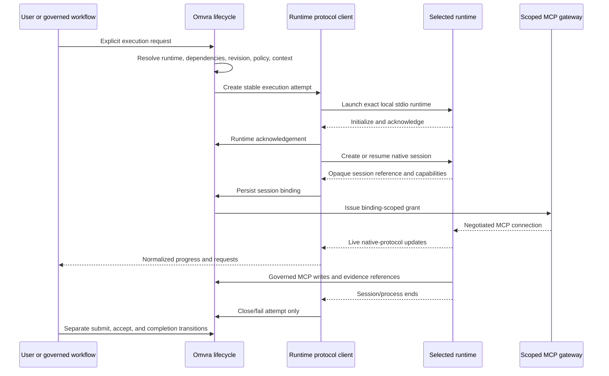

# ACP runtime, session binding, and lifecycle contract

Status: proposed architecture for human acceptance  
Decision date: 2026-07-29  
Task: `task-e245b4ab-1b7c-48c9-9742-58c448c5aa9c`

## Summary

Add local agent runtimes as protocol-specific clients inside the existing Electron modular monolith. Omvra agent identity, installed runtime, protocol, and model provider remain separate. Runtime selection is deterministic and visible. Session bindings live in a separate versioned store and correlate one runtime-owned opaque session reference with one stable Omvra execution attempt.

ACP owns live interaction. Existing task collaboration, Goal lifecycle, context ledger, evidence, revision, acceptance, archive, backup, and audit contracts remain authoritative. A session ending never submits, accepts, completes, archives, or abandons Omvra work.

The first release supports explicitly configured local stdio runtimes using either native ACP or the native Codex app-server protocol, plus a user-invoked external handoff. Omvra launches the installed runtime directly; it does not require a separately installed protocol-conversion executable. Stdio is a locality and process-lifecycle choice, not a single-agent restriction: Omvra may coordinate multiple concurrent sessions in one capable runtime and/or multiple explicitly started runtime subprocesses. Distributed runtime pools and remote transports remain deferred.

Agent-runtime and MCP transports are independent. ACP or Codex app-server carries runtime/session control over local stdio; MCP carries governed Omvra reads and writes through a separately negotiated, session-scoped connection. The first release does not give a runtime the existing workspace-wide HTTP bearer token or unrestricted stdio MCP access. Codex authentication remains owned by Codex and is only observed through `account/read`; Omvra does not collect provider credentials. The release does not add automatic spawning, watcher dispatch, remote gateways, arbitrary runtime plugins, or silent failover.

## Decision drivers

### Verified facts

- Task collaboration already has stable contribution and execution-attempt IDs, distinct attempt/contribution/task lifecycle states, and separate append-only event history.
- Runtime, session, transcript, credential, and usage fields are rejected from the task collaboration projection.
- Goal execution already owns acknowledgement, dispatch, retry, evidence, acceptance, and completion independently of any provider session.
- `agent.resolve_task_context` is the canonical assigned-task preflight; the task-context ledger is the bounded, source-linked portability seam.
- MCP transports and runtime protocol clients must remain separate adapters over the domain layer.
- Current MCP HTTP bearer authentication and stdio transport access are workspace-level boundaries, not ACP session authorization boundaries.
- MCP audit records are bounded and redacted. Workspace backup/restore preserves versioned workspace records and unknown fields.

### Constraints

- Preserve legacy/direct task execution when no runtime or session record exists.
- Preserve `__mcpRevision`, collaboration attempt identity, Goal revisions, public MCP contracts, and current storage keys.
- Store no provider credentials, raw prompts, raw responses, raw tool payloads, hidden reasoning, or full transcripts.
- Do not place MCP credentials in prompts, task records, launch arguments, general audit, or provider-owned session metadata.
- Do not infer unsupported ACP capabilities or missing token/cost values.
- Keep one Electron deployment and one workspace. No service split or plugin framework is justified.

### Quality goals

- Deterministic runtime selection with visible, explicit failure.
- Provider-portable work context without transcript replay.
- Crash and close behavior that cannot silently change durable work state.
- Bounded, privacy-safe persistence and audit.
- Backward-compatible delivery in small, independently testable phases.

## Architecture options

| Option | Structure | Benefits | Costs and risks | Conditions |
| --- | --- | --- | --- | --- |
| Keep runtime/session data on collaboration, Goal nodes, or tasks | Add provider fields to current projections | Smallest initial lookup path | Couples identity to runtime, leaks runtime concerns into durable work, grows current records, conflicts with existing validation | Rejected |
| Separate runtime profiles and session bindings behind in-process protocol clients | New versioned records; native ACP and Codex clients call existing task/Goal/context/evidence domains | Preserves ownership, supports multiple runtimes without external conversion tools, bounded migration, reuses current deployment | Requires correlated writes, explicit recovery, and maintained protocol-specific clients | **Selected** |
| Separate runtime service or arbitrary plugin host | New process/service owns runtime profiles and sessions | Strong isolation and extension flexibility | Adds authentication, synchronization, deployment, and plugin security cost before a demonstrated need | Rejected for the first release |

The selected option uses local stdio because Omvra owns the child process and can correlate launch, exit, crash, cancellation, and cleanup without opening a listening endpoint. ACP-capable runtimes use ACP directly. Codex uses its native `codex app-server --stdio` JSONL protocol directly; Omvra does not route Codex through a Codex-to-ACP executable. HTTP or WebSocket becomes useful when a runtime must live on another machine, be shared independently of the desktop process, or scale as a distributed pool. No transport supplies orchestration: Omvra remains responsible for delegation, concurrency, dependencies, evidence, retries, budgets, and acceptance.

## Recommendation

Use separate in-process protocol clients and versioned records. This is the smallest design that connects directly to installed runtimes without binding personas to providers or requiring external conversion tools, while preserving the existing domain authority and deployment model. Reconsider process isolation only if a supported remote runtime, untrusted third-party runtime, or independently deployed execution tier creates a demonstrated isolation requirement.

## Evidence versus assumptions

Evidence: current collaboration validation already excludes runtime data; stable attempt IDs and lifecycle transitions exist; Goal policy/evidence and MCP audit boundaries are implemented; Electron main-process composition already hosts local protocol adapters.

Assumptions to validate during each protocol-client spike: the runtime exposes stable initialization/capability behavior, its opaque session reference can be restored reliably, and process-level interruption can be distinguished from an acknowledged cancellation. Codex app-server schemas are version-specific, so the installed executable remains the source of truth. Failure of any assumption narrows resume or capability support; it does not justify simulated behavior or silent fallback.

## Identity and ownership boundaries

| Concept | Owner | Durable meaning |
| --- | --- | --- |
| Omvra agent identity | Person/task/Goal contracts | Persona, instructions, assignment, contribution role, and accountability |
| Runtime profile | Agent runtime configuration | One exact installed application, native protocol, and launch method |
| Model provider | External runtime, observed by Omvra when reported | Authentication, billing, provider limits, and model access |
| Execution attempt | Task collaboration or Goal lifecycle | One governed attempt to perform a bounded work scope |
| ACP session binding | ACP adapter store | Correlation between one execution attempt and one runtime-owned session |
| Context checkpoint | Task-context or Goal evidence contracts | Provider-portable durable work history |

No identity implies another. Assigning Arc, Codex, or any other Omvra persona does not choose a runtime or provider. Changing a runtime does not transfer task ownership, contribution identity, Goal-node ownership, or acceptance authority.

## Runtime profile and resolution contract

Runtime profiles are stored separately under `omvra.agentRuntimeProfiles.v1`. Defaults are workspace settings, not person fields.

```ts
type RuntimeIntegrationMode = 'external-handoff' | 'acp-local-stdio' | 'codex-app-server-stdio';

interface AgentRuntimeProfileV1 {
  schemaVersion: 1;
  id: string;
  name: string;
  integrationMode: RuntimeIntegrationMode;
  executablePath?: string;
  fixedArgs?: string[];
  externalUrlScheme?: string;
  enabled: boolean;
  createdAt: string;
  updatedAt: string;
}

interface AgentRuntimeDefaultsV1 {
  schemaVersion: 1;
  globalRuntimeProfileId?: string;
  projectRuntimeProfileIds: Record<string, string>;
}
```

The profile contains launch configuration only. Provider name, implementation/version, model/mode, capabilities, availability, authentication state, and usage are runtime observations. Credentials, tokens, cookies, provider account IDs, and billing instruments are forbidden.

Runtime resolution uses exactly this order:

1. execution request override;
2. project default for the work scope;
3. global default.

Resolution returns the selected profile ID and source (`execution`, `project`, or `global`). If no profile resolves, or the selected profile is disabled, missing, incompatible, unavailable, or requires authentication, preflight fails visibly. Omvra does not try the next default and does not substitute another runtime. A user may explicitly choose a different profile or invoke external handoff.

Connection testing launches the exact executable and argument array without shell interpolation, performs ACP initialization plus capability/authentication discovery, then terminates without creating an execution attempt, session, or model turn.

## Runtime observation and capability contract

Observations are refreshed during connection and session preflight. Persist only the latest bounded observation plus normalized session events.

```ts
type RuntimeAvailability = 'available' | 'unavailable' | 'unknown';
type RuntimeAuthentication = 'authenticated' | 'required' | 'unknown';
type CapabilitySupport = 'supported' | 'unsupported' | 'unknown';

interface RuntimeCapabilityObservationV1 {
  id: string;
  support: CapabilitySupport;
  version?: string;
}

interface RuntimeObservationV1 {
  runtimeProfileId: string;
  implementationName?: string;
  adapterVersion?: string;
  providerName?: string;
  modelOrMode?: string;
  availability: RuntimeAvailability;
  authentication: RuntimeAuthentication;
  capabilities: RuntimeCapabilityObservationV1[];
  observedAt: string;
}
```

`unknown` is distinct from `unsupported`, and missing usage is distinct from zero. A control may execute only when its required capability is `supported`. `unsupported` or `unknown` fails with a visible normalized capability error; Omvra never simulates the operation or silently uses a different mechanism.

Provider-reported tokens, context usage, and cost are optional observations labelled `reported`. They may support warnings or bounded cancellation policy, but Omvra does not claim that they equal the provider bill.

## Session binding contract

Store bindings separately under `omvra.acpSessionBindings.v1`. Current task, collaboration, and editable Goal graph records contain at most a `sessionBindingId` correlation field on their stable execution-attempt record. They never contain the opaque session reference.

```ts
type AcpSessionState =
  | 'starting'
  | 'ready'
  | 'active'
  | 'needs-input'
  | 'cancelling'
  | 'interrupted'
  | 'closed'
  | 'failed';

type AcpWorkScopeV1 =
  | {
      kind: 'task';
      taskId: string;
      contributionId?: string;
      executionAttemptId: string;
      taskRevision: number;
    }
  | {
      kind: 'goal-node';
      goalId: string;
      goalElementId: string;
      goalExecutionId: string;
      executionAttempt: number;
      goalRevision: number;
    };

interface AcpSessionBindingV1 {
  schemaVersion: 1;
  id: string;
  runtimeProfileId: string;
  scope: AcpWorkScopeV1;
  opaqueSessionRef?: string;
  mcpGrantId?: string;
  state: AcpSessionState;
  capabilities: RuntimeCapabilityObservationV1[];
  createdAt: string;
  updatedAt: string;
  lastObservedAt: string;
  terminalReason?: 'closed' | 'cancelled' | 'process-exit' | 'runtime-missing' | 'protocol-error';
  closedAt?: string;
}
```

Binding invariants:

- One binding references exactly one runtime profile and one task or Goal-node execution attempt.
- One execution attempt has at most one active binding. Starting a fresh provider session requires a new execution attempt; resuming the same provider-owned session keeps the existing binding and attempt.
- An active or resumable binding requires `opaqueSessionRef`; terminal retention may clear it without deleting the binding record.
- `opaqueSessionRef` is a runtime-owned correlation token, not an agent identity, credential, transcript locator, acceptance signal, or authority grant.
- `mcpGrantId` correlates a separately managed MCP authorization grant. It is not the bearer secret and cannot be exchanged for one through workspace reads.
- The captured task/Goal revision identifies the context used to start the session. A later revision marks the session context stale; it does not roll back the work record or authorize overwriting the newer revision.
- Every governed write still supplies the current task or Goal revision. The adapter cannot bypass optimistic concurrency.
- Capabilities are a start-time snapshot for reproducibility. Current controls also consult the latest observation and fail if support is no longer available.
- Bindings preserve unknown fields across backup/restore and no-op migration.

## Session-scoped MCP access contract

Starting an ACP session and granting MCP access are separate operations. After task/Goal preflight succeeds, Omvra may issue an ephemeral MCP grant bound to:

- the ACP binding ID and exact task/contribution or Goal-node execution attempt;
- the approved MCP capability profile and project/workspace scope;
- an issued-at time, expiry, and revocation state.

The grant authorizes only the capabilities needed by that work scope. It does not bypass task/Goal revisions, dependency gates, policy, evidence, audit, or acceptance. Session close, cancellation, terminal failure, archive, or explicit revocation invalidates it; expiry never advances lifecycle state.

Transport is negotiated independently of ACP:

- An HTTP-capable runtime receives a loopback Omvra MCP endpoint with a short-lived scoped bearer credential through a protected runtime configuration channel.
- A stdio-only runtime receives an Omvra-managed scoped MCP proxy that enforces the same grant before dispatching to the shared domain services.
- The existing workspace-wide HTTP bearer token and the unrestricted `mcp-stdio.cjs` entry point are not passed to ACP sessions.

The secret is held in memory and omitted from prompts, task/Goal records, binding metadata, environment diagnostics, command-line arguments, general audit, and backups. Persist only the non-secret grant correlation ID and bounded issue/expiry/revocation facts. External handoff receives no MCP grant automatically.

## Lifecycle contract

The following facts are distinct and must have distinct event types and owners:

| Fact | Durable owner | Effect |
| --- | --- | --- |
| External handoff prepared/opened | Runtime handoff audit plus optional handed-off attempt | No ACP session; no proof of model execution; no contribution/task/Goal advancement |
| Runtime acknowledged | Existing task/Goal attempt lifecycle | Runtime accepted the work request; may enter acknowledged/working according to that lifecycle |
| ACP session started or resumed | ACP binding/event store | Creates or reactivates one binding; does not submit or accept work |
| Live progress, plan, tool, permission, or input update | Bounded ACP event stream | Presentation/steering only; never authoritative task or Goal state |
| Runtime process completed | Execution attempt lifecycle | Attempt may become `completed`; contribution, Goal output, and task status are unchanged |
| Contribution submitted | Task collaboration lifecycle | Requires durable evidence; becomes `submitted`, not accepted |
| Contribution accepted | Task collaboration lifecycle | Orchestrator accepts evidence; aggregate task remains separate |
| Goal evidence/handoff accepted | Goal lifecycle | Advances only through existing governed Goal commands and gates |
| Aggregate review/completion | Task status/human review or Goal delivery lifecycle | Existing acceptance authority remains required |



## Closure, crash, resume, cancellation, and missing runtime

- **Explicit close:** mark the binding `closed` and close or stop the attempt. Preserve durable Omvra state. Closing cannot submit, accept, complete, delete, archive, or abandon work.
- **Normal process exit:** record the observed exit and mark the attempt `completed` only when the existing lifecycle permits it. Contribution/task/Goal state does not advance automatically.
- **Crash or lost transport:** mark the binding `interrupted` and the attempt `failed` or `stopped` through the existing lifecycle. Keep the work scope and checkpoint available.
- **Resume:** allowed only with the same runtime profile when session-resume capability is `supported` and the opaque reference remains valid. Otherwise the user starts a new execution attempt and receives the latest accepted Omvra context pack.
- **Cancellation:** enter `cancelling`, issue the selected protocol's cancel operation only when supported, and wait for acknowledgement. A timeout becomes `interrupted`; Omvra does not claim cancellation succeeded. The attempt stops only through its existing transition.
- **Missing or unavailable runtime:** fail before session creation. Do not create a fabricated session, background retry, or fallback attempt. External handoff remains a separate explicit action.
- **Authentication required:** surface the runtime-provided method or agent-native sign-in instruction. Omvra never receives or persists the credential.
- **MCP grant failure or expiry:** deny MCP access visibly without falling back to a broader token or transport. The ACP session may remain open for user steering, but it cannot claim governed Omvra work succeeded.
- **Stale work revision:** keep the session visible as stale, require context refresh, and let the normal revision contract reject stale writes.

Active and interrupted bindings retain the opaque reference so a supported resume is possible. Explicitly closed, cancelled, or archived bindings retain normalized metadata and correlation IDs but remove the opaque reference. In the first release, normalized terminal bindings and events remain with the workspace until the workspace is deleted; reads stay bounded. There is no background retention job. A later configurable expiry policy may shorten that metadata retention without restoring or extending session resumability.

## Local-stdio first-release boundary

- Native ACP and Codex app-server clients run in the Electron main process behind the existing domain facades; neither is a domain dependency or imports MCP internals.
- Codex profiles launch the configured Codex executable with `app-server --stdio`. Omvra speaks Codex JSONL directly, sends `initialize`/`initialized`, and observes existing authentication with `account/read`; no Codex-to-ACP executable is installed or invoked.
- Launch requires an explicit user or already-governed Goal action. Assignment, delegation eligibility, watcher changes, and board polling cannot launch it.
- The executable path is exact, fixed arguments are an array, the workspace directory is validated, and no shell interpolation is used.
- Only the selected runtime receives the bounded context pack and session-scoped Omvra MCP connection configuration required for the scope.
- Omvra may run explicitly requested task/contribution or Goal-node attempts concurrently. A runtime may multiplex concurrent sessions when its native protocol advertises that capability; otherwise Omvra uses separately managed subprocesses. Join behavior is based on accepted durable outputs, never shared transcripts or session proximity.
- This is local multi-agent execution, not a remote/shared agent pool. Remote ACP over HTTP/WebSocket may later expand deployment location and independent scaling without changing the collaboration, session-binding, MCP-grant, or acceptance contracts.
- Remote gateways, hosted agents, Omvra-owned provider credentials, provider SDKs, arbitrary runtime/plugin installation, recursive agent trees, background relaunch, and silent runtime failover are out of scope.
- `Open externally` uses an allowlisted application link or exact executable handoff. It records `external-handoff` only, creates no ACP binding or MCP grant, does not prove authentication or execution, and does not change task/Goal status. The UI should describe this as opening/preparing work externally, not starting or sending an ACP session.

## Alignment with existing Omvra contracts

### Collaboration and task status

Task collaboration attempts may add `sessionBindingId`; task and collaboration projections continue to reject runtime/session payloads. Attempt completion and session closure do not change contribution state or aggregate task status. Submission requires evidence and acceptance remains orchestrator/human governed.

### Goal lifecycle

The editable Goal graph stores no session. A binding references the immutable Goal execution ID, agent-node ID, attempt number, and Goal revision. Dispatch, acknowledgement, retry, pause, evidence, handoff, approval, and completion remain Goal lifecycle commands.

### Context ledger and evidence

ACP receives the latest accepted checkpoint and bounded history index from Omvra. Live transcripts and tool payloads are not copied into the ledger. Only concise source-linked decisions, blockers, evidence, handoffs, and checkpoints are appended. Agent-authored entries cannot represent human acceptance.

### Audit and telemetry

Use a bounded ACP session-event stream correlated by binding ID, runtime profile ID, work-scope IDs, and attempt ID. Audit records omit `opaqueSessionRef`, prompts, responses, transcripts, tool payloads, credentials, evidence bodies, and hidden reasoning. Usage/cost fields retain missing-versus-zero semantics and a `reported` provenance label.

### Archive, backup, and restore

- Archiving is blocked while a binding is `starting`, `ready`, `active`, `needs-input`, or `cancelling`.
- The user must cancel/close the session or explicitly resolve an interrupted attempt first.
- Archive cleanup removes resumability by clearing the opaque reference while preserving normalized metadata, context, evidence, lifecycle, and audit history.
- Restoring archived work starts from a durable Omvra checkpoint; it never silently resumes a provider session.
- Workspace backup/restore includes runtime profiles, defaults, session-binding metadata, attempts, normalized events, context entries, and evidence references. It excludes provider credentials and raw transcripts.

## Failure contract

Adapters return stable, visible failure classes such as:

- `ACP_RUNTIME_NOT_CONFIGURED`
- `ACP_RUNTIME_DISABLED`
- `ACP_RUNTIME_MISSING`
- `ACP_RUNTIME_UNAVAILABLE`
- `ACP_AUTHENTICATION_REQUIRED`
- `ACP_PROTOCOL_INCOMPATIBLE`
- `ACP_CAPABILITY_UNSUPPORTED`
- `ACP_SESSION_NOT_FOUND`
- `ACP_SESSION_RESUME_UNSUPPORTED`
- `ACP_SESSION_INTERRUPTED`
- `ACP_MCP_GRANT_FAILED`
- `ACP_MCP_GRANT_EXPIRED`
- `ACP_MCP_CAPABILITY_DENIED`
- `REVISION_MISMATCH`

No failure class authorizes fallback, lifecycle advancement, or data deletion. Retry creates no duplicate binding or event when the same idempotency key is replayed.

## Migration and implementation sequence

1. Accept this contract and the task-context ledger contract.
2. Add normalized runtime-profile/default validation and persistence without launching processes.
3. Add connection preflight and explicit external handoff with redacted audit.
4. Add the separate session-binding/event store and `sessionBindingId` attempt extension.
5. Add native local-stdio ACP and Codex app-server clients with focused initialization/capability/auth tests.
6. Add the session-scoped MCP grant/gateway boundary; prove that both negotiated transports deny out-of-scope and expired access without broader fallback.
7. Bind one user-initiated task attempt; pass bounded context plus scoped MCP configuration.
8. Add steering, input, permission, cancel, close, crash, and resume behavior only where negotiated capabilities support them.
9. Add Goal-node binding after task behavior passes lifecycle, archive, backup, and privacy QA.
10. Prove local multi-agent coordination with concurrent bounded attempts, then prove portability with a second runtime using the same accepted checkpoint, not a copied transcript.

Rollback preserves runtime profiles, bindings, attempts, events, and unknown fields. Disabling agent-runtime integration hides execution controls but leaves direct task/Goal behavior unchanged.

## Risks and mitigations

- **Identity/runtime coupling:** profiles and defaults are separate from people; resolution never reads persona as a runtime choice.
- **Premature completion:** session/attempt events cannot mutate submission, acceptance, task status, or Goal delivery.
- **Credential or transcript leakage:** forbidden fields at profile, binding, context, audit, export, and backup boundaries; add privacy-negative fixtures.
- **Over-broad MCP authority:** issue an ephemeral binding-scoped grant, enforce it at either negotiated MCP transport, revoke it on terminal session events, and never fall back to the workspace-wide token or unrestricted stdio entry point.
- **Capability drift:** persist observations with timestamps, refresh at preflight, and fail unsupported controls visibly.
- **Stale session context:** capture the starting revision, show staleness, and retain existing revision checks on every write.
- **Orphaned sessions after crash:** persist binding before the first model turn, use idempotency, reconcile on startup, and require explicit resume/close.
- **Cross-store partial writes:** follow the current event-first, revision-correlated, idempotent reconciliation pattern; adapters do not sequence domain mutations independently.
- **Unsafe local launch:** exact executable/args, validated working directory, no shell, no automatic relaunch or fallback.

## Verification plan

- Runtime resolution: override/project/global precedence; missing, disabled, unavailable, auth-required, and no-fallback paths.
- Capability negotiation: supported, unsupported, unknown, version drift, and missing-versus-zero usage.
- Binding: task, contribution, Goal node, execution attempt, revision, capability snapshot, stable ID, and idempotent retry.
- Lifecycle: external handoff without execution; acknowledgement without session; session close/crash/process completion without submission or aggregate completion; separate submission and acceptance.
- Recovery: resume supported/unsupported, lost opaque reference, stale revision, cancel timeout, startup reconciliation, and missing runtime.
- Privacy: no credential, prompt, response, transcript, tool payload, hidden reasoning, evidence body, or opaque session reference in task, collaboration, Goal graph, context index, general audit, cards, or exports.
- Persistence: reload, backup/restore, archive/restore, unknown-field preservation, and ACP-disabled rollback.
- Integration: direct task execution and Goals without session fields remain unchanged; MCP and native runtime clients remain siblings over domain services.
- MCP authorization: grant scope, expiry, revocation, redaction, HTTP and scoped-proxy parity, and rejection of broader fallback.
- Local multi-agent execution: concurrent session multiplexing when supported, separate subprocess isolation otherwise, and joins gated by accepted durable outputs.

## Acceptance mapping

- Multiple runtimes are supported through separate profiles/defaults; personas never bind to providers.
- Session closing, process exit, crash, and cancellation cannot complete or abandon Omvra work.
- Provider credentials and raw transcripts are forbidden from workspace records.
- Unsupported and unknown capabilities fail visibly and are never simulated.
- Runtime and MCP transports are independent; every governed runtime session receives only an ephemeral scope-bound MCP grant.
- Local stdio permits bounded concurrent multi-agent work without implying a distributed runtime pool.
- Automatic spawning, watcher dispatch, remote gateways, arbitrary plugins, and silent failover remain outside the first release.

## Remaining product decisions

- The second native runtime protocol used to prove portability beyond ACP and Codex app-server.
- Which installed applications support a safe review-before-send external handoff.
- The later user-configurable retention duration for normalized closed-session events.
- Whether provider-reported cost is warning-only or may trigger a governed cancellation threshold.

## Recommended next handoff

After human acceptance, use the component-boundary review for the runtime-profile store, native protocol clients, session-binding store, and existing task/Goal domain seams before implementation. Runtime behavior should then be verified against the lifecycle and recovery cases in this contract.
