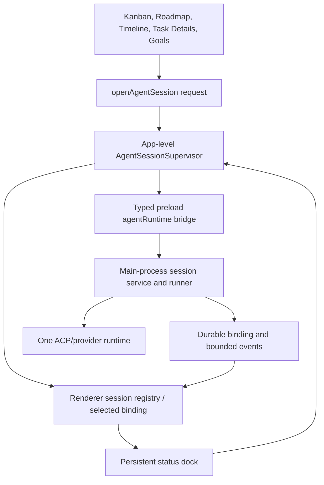

# Agent Session Supervision, Launch Routing, and Concurrency

Date: 2026-08-05
Status: authoritative product and roadmap handoff
Scope: Omvra desktop ACP/runtime sessions launched from Task Details, Kanban, Roadmap, Timeline, and Goal surfaces

Related source contracts:

- [ACP runtime/session lifecycle contract](./acp-runtime-session-lifecycle-contract.md) — provider-neutral runtime, binding, recovery, MCP-grant, and privacy rules.
- [Task orchestration and multi-agent collaboration](./task-orchestration-and-multi-agent-collaboration.md) — contribution attempts, evidence, revisions, dependencies, and human acceptance.
- [Omvra product polish task list](../plans/OMVRA-POLISH-TASK-LIST.md) — umbrella visual and interaction rollout; this work contributes to P0.2, P0.3, and P0.4.

## Executive decision

For the first-release supervision experience, Omvra has one app-level session supervisor and one active local agent session at a time.

The supervisor must remain mounted independently of task dialogs, milestone sheets, Kanban cards, and Roadmap panels. Those surfaces should request supervision for a task or Goal node; they must not own the ACP session panel or its lifecycle.

Closing the supervisor must mean **hide/minimize**. It must not cancel the runtime or close the provider connection. Cancellation and provider-session termination must be separate, explicit actions.

The one-session limit is an intentional first-release operating constraint. It protects local CPU/memory, avoids ambiguous MCP writes, keeps repository execution predictable, and creates a simpler user model. The limit must be enforced in the main process, not only by disabling buttons in the renderer.

This is a supervision-product policy, not a rewrite of the provider-neutral runtime contract. The runtime remains capable of representing one binding per execution attempt and provider-specific capabilities; enabling concurrent sessions later requires a separately accepted capacity and UX decision. It is not implied by this handoff.

## Scope, non-goals, and ownership

### In scope

- One app-level renderer supervisor with stable visibility, reopen, hide, cancel, and end-session semantics.
- Main-process enforcement of one active task or Goal-node session across all launch surfaces.
- A normalized session registry and bounded event projection that remain available when the originating dialog, sheet, card, or panel unmounts.
- Provider liveness, interruption, recovery, and resumability signals for the supported local provider profiles.
- Rollout and QA evidence for the existing provider-neutral runtime, task contribution lifecycle, Goal lifecycle, and polish surfaces.

### Non-goals

- No cloud synchronization, remote/shared agent pool, HTTP/WebSocket runtime gateway, or provider credential service.
- No automatic task completion, contribution acceptance, Goal completion, dependency advancement, or human acceptance from ACP events, provider completion, session close, or session cancellation.
- No watcher-triggered launch, automatic retry/relaunch, silent provider failover, transcript persistence, or second runtime/persistence abstraction.
- No removal of the broader provider-neutral capability model; unsupported provider capabilities remain unavailable rather than simulated.

### State ownership and acceptance ownership

These states remain separate and must be reported separately:

| State | Authority | What may change it | What it cannot imply |
| --- | --- | --- | --- |
| Task contribution/attempt | Existing task collaboration lifecycle | Governed task commands with current revision, evidence, and dependency rules | ACP session health or human acceptance |
| ACP session/binding | Main-process runtime/session service | Explicit start, resume, cancel, provider events, liveness, and end-session commands | Contribution submission, task status, Goal completion, or acceptance |
| Human acceptance/review | Existing trusted human/task or Goal acceptance path | Human review/approval commands and required evidence | Provider completion or agent-authored notes alone |

Goal acknowledgement, dispatch, retry, pause, evidence, handoff, approval, and completion remain owned by the Goal lifecycle. The session supervisor is a visibility and runtime-control surface; it is not a Goal state machine or task database.

### Dependencies and acceptance ownership

- **Runtime/session owner:** Electron main-process session service and native protocol clients, governed by the [ACP runtime/session lifecycle contract](./acp-runtime-session-lifecycle-contract.md).
- **Task contribution owner:** existing task collaboration lifecycle and revision-protected task commands, governed by the [task orchestration contract](./task-orchestration-and-multi-agent-collaboration.md).
- **Goal owner:** existing Goal lifecycle service and approval/evidence gates; ACP only binds to the immutable Goal execution attempt.
- **Renderer owner:** the app-level `AgentSessionSupervisor`; launch surfaces issue requests and do not own session lifecycle.
- **Product/human acceptance owner:** the human reviewer and existing task/Goal acceptance path. Engineering QA may report evidence and blockers but cannot accept the work on behalf of the product owner.
- **Release/architecture dependency:** integration QA `task-f6e301e0-9137-4d53-8469-f52536404d18`; ACP release QA `task-0e98041c-40d4-4c00-86b7-d9c2022e615e`; post-ACP consolidation entry `task-b5f23e60-4174-431b-b5a5-d939ed8fb4f6` remains downstream of release QA.

The one-session rule applies to explicit task/contribution and Goal-node starts in this first-release supervision surface. It does not authorize cloud coordination or automatic dispatch, and it does not alter the durable identities, revisions, evidence, dependency gates, or acceptance rules of those existing lifecycles.

## Evidence and diagnosis

### Confirmed code paths

`TaskExecutionAction` owns its own `open`, `startRequested`, `binding`, event, request, and operation state.

Kanban path:

1. A Kanban card opens `TaskDetailsDialog`.
2. The details action menu calls `onStartWork`.
3. `TaskDetailsDialog` calls `onClose()` and then increments `startWorkRequest`.
4. `TaskExecutionAction` is mounted inside `TaskDetailsDialog`.
5. Closing the dialog unmounts `TaskExecutionAction` before the `openRequest` can be consumed.

Roadmap path:

1. `MilestoneExecutionAction` renders a task row containing `TaskExecutionAction`.
2. The nested action receives `onOpen={() => setOpen(false)}`.
3. The nested trigger calls `onOpen?.()` before setting its own `open` state.
4. The parent milestone sheet closes and unmounts the nested `TaskExecutionAction`.

Timeline is different: `DraggableTimelineTask` keeps the `TaskExecutionAction` mounted and increments an `openRequest`, so it does not depend on a parent dialog surviving the launch.

### Runtime consequence

There is no evidence that Kanban/Roadmap intentionally launch a hidden background chat. The stronger explanation is that the renderer-side session owner is destroyed during the launch handoff.

If a runtime has already been created, the main-process session can continue while the renderer has no mounted supervisor to display it. That produces the reported blackboxed state.

`refreshSession` also runs only while the local `TaskExecutionAction` is open. There is no app-level session observer that keeps a persistent status dock synchronized while the panel is hidden or its original parent is gone.

### Status-area consequence

The existing `AppStatusBar` rolls up configured people, task assignment, watcher runtime, MCP audit activity, and agent statuses. It does not represent the canonical ACP session registry. Therefore a pill such as `Agents · Unavailable 10` is not a reliable indicator of whether a local ACP session is active, hidden, or resumable.

The product needs separate concepts for:

- configured agent availability;
- MCP availability;
- current ACP session state;
- human input required;
- completed or failed session history.

### Long-lived app and provider disconnects

The missing dialog and a lost provider connection are separate failure modes.
The first is a renderer ownership bug: a parent surface unmounts the local
`TaskExecutionAction` during launch. The second is a runtime-liveness gap that
can appear after the app has been open or idle for a long time.

The current local ACP transport owns a child process and can observe process
exit, transport failure, or request timeout, but the session runner must turn
those signals into a durable binding state. Otherwise a binding can remain
apparently `ready` while its provider process or transport is no longer usable.
The next attempt then fails late, and the user sees no supervision panel that
explains whether the session can be resumed.

The implementation must therefore:

- propagate provider-process exit and transport failure to the main-process
  session binding even when no request is in flight;
- remove or invalidate the dead client and append a bounded, redacted failure
  event with the provider/profile and last-seen timestamp;
- expose a clear `interrupted`/`connection lost` state that the app-level
  supervisor can reopen from any surface;
- run a bounded liveness/reconciliation check when the app starts, when the
  supervisor is reopened, and while an active session is expected to be live;
- offer `Resume` only when the provider/session contract supports it, otherwise
  require an explicit new start without silently replacing the old history;
- validate the behavior against every supported local provider profile,
  including Codex and Claude, rather than attributing the problem to one
  provider before runtime evidence exists.

## Product rules

### Session ownership

- The Electron/main-process runtime remains the authority for provider process, ACP transport, binding, session reference, events, cancellation, and termination.
- The app-level supervisor owns the selected visible session and its renderer subscription.
- Task, milestone, Roadmap, Kanban, Timeline, and Goal surfaces are launch/request surfaces only.
- A task dialog or milestone sheet may close after requesting supervision; the session must not depend on that component remaining mounted.

### Visibility semantics

- `Open supervision`: show the supervisor for the current session.
- `Hide`: remove the supervisor from the foreground while preserving the runtime and session.
- `Reopen`: restore the same session, event history, pending input, and task context.
- `Cancel work`: explicitly request runtime cancellation; this is not a hide action.
- `End session`: explicitly close the provider session when supported; this is an advanced lifecycle action.

### Concurrency

For the initial implementation, only one active session is allowed across task sessions and Goal agent-node sessions.

Active states include:

- `starting`
- `ready` when the session is reserved for immediate work
- `active`
- `needs-input`
- `cancelling`

Terminal or non-active states include:

- `interrupted`
- `failed`
- `complete`/finished provider state
- `closed`

The main process must reject a second start while any active session exists. The rejection must identify the active binding and provide an action to open supervision for it.

This is a concurrency limit, not a deletion or replacement policy. Starting a second task must never silently close or replace the first session.

## Proposed architecture



### App-level supervisor responsibilities

- subscribe to session registry changes or poll through one centralized hook;
- select the active binding by task or Goal-node scope;
- preserve selected session identity when the originating surface closes;
- render the supervision panel in a stable portal/sheet location;
- keep event/activity/request state alive when minimized;
- reopen a session from task, status dock, notification, or active-session action;
- expose `Hide`, `Open supervision`, `Cancel`, and advanced `End session` semantics;
- display clear loading, unavailable, failed, needs-input, and terminal states;
- show an explicit second-session blocker with an `Open active session` action.

### Launch-request contract

The launch surfaces should send an intent rather than mount a nested execution panel:

```ts
type AgentSessionOpenRequest = {
  scope: { kind: 'task'; taskId: string } | {
    kind: 'goal-node';
    goalId: string;
    goalElementId: string;
    goalExecutionId?: string;
  };
  mode: 'start' | 'open-existing';
  source: 'kanban' | 'roadmap' | 'timeline' | 'task-details' | 'goal';
};
```

The exact transport may reuse existing React state/context and preload methods. Do not introduce a second runtime or persistence abstraction without evidence that existing session listing/binding services cannot support the supervisor.

### Session registry

The renderer needs one normalized read model containing at least:

- binding ID;
- scope and task/Goal identity;
- state and terminal reason;
- selected/visible state;
- runtime/provider label;
- task title or Goal-node title;
- latest activity timestamp;
- pending input request state;
- resumability and supported capabilities;
- error or blocker summary;
- bounded event/activity projection.

Opaque provider session references must remain outside renderer-authored durable task context. The registry may retain them through the existing main-process binding contract.

## Required state behavior

| Situation | Status dock | Supervisor | Primary action |
| --- | --- | --- | --- |
| No session | No active work | Hidden | Start work from a task/Goal |
| Starting | Starting | Open automatically | Wait / cancel if supported |
| Active | Working · task title | Open or minimized | Hide, steer, cancel |
| Needs input | Input needed · task title | Open automatically or visibly highlighted | Respond |
| Hidden active | Working · task title | Hidden | Open supervision |
| Interrupted | Paused/interrupted | Reopenable | Resume or cancel |
| Failed | Failed · task title | Reopenable with evidence | Retry or inspect |
| Completed | Completed briefly, then history | Reopenable until dismissed | Review handoff |
| Second start requested | Existing session active | Existing supervisor highlighted | Open active session |

## Acceptance criteria

### Launch routing

- Starting work from Kanban opens the app-level supervisor and does not lose the request when Task Details closes.
- Starting work from Roadmap opens the app-level supervisor and does not lose the request when the milestone sheet closes.
- Timeline continues to work through the same supervisor path rather than a separate nested implementation.
- Starting from Goal surfaces uses the same visibility and concurrency policy.
- No launch surface mounts a session panel that owns the ACP lifecycle.

### Minimize and restore

- Hiding the supervisor does not call ACP cancel or close.
- The runtime continues to produce bounded activity/events while hidden.
- Reopening shows the current binding, latest activity, pending request, and current state.
- Closing the originating task or milestone surface does not hide or terminate an active session.
- Cancel is explicit, visible, and distinguishable from Hide.

### Provider liveness and recovery

- A provider child-process exit, transport error, or unrecoverable timeout
  changes the binding state without requiring the supervision panel to be open.
- Reopening after a long idle period shows the last provider event, connection
  state, and a concrete Resume/Reconnect or Start-new-session action.
- A stale `ready` binding cannot block all future work without an actionable
  recovery path.
- Codex and Claude profiles each have an automated or reproducible manual test
  covering idle, provider exit, reopen, resume/reconnect, and explicit cancel.

### Single-session policy

- The main process rejects a second active task or Goal-node session.
- The rejection is deterministic and includes the active binding ID/scope in a safe projection.
- The renderer disables or explains competing Start work actions while another session is active.
- No second provider process is spawned after the rejection.
- A user can open the active session from the rejection or status dock.
- Terminal sessions release the concurrency slot according to the existing lifecycle contract.

### Status area

- The status area distinguishes configured-agent availability from ACP session state.
- An active session is clickable and reopens supervision.
- A hidden session remains discoverable.
- `Unavailable` is not shown as the only explanation when a session is active or when the issue is MCP/runtime configuration.
- Status is keyboard accessible and communicates state without relying only on color.

### Verification

- Focused renderer tests cover launch requests, unmounting parents, minimize/restore, and second-session blocking.
- Main-process tests cover task plus Goal-node global concurrency and slot release after terminal states.
- Manual QA covers Kanban, Roadmap, Timeline, Task Details, Goals, hidden active work, pending input, failure, resume, cancel, and restart/reopen behavior.
- Build and relevant MCP/runtime contract tests pass.

## Rollout sequence and QA handoff

1. **Contract gate:** preserve the provider-neutral runtime/session contract, task contribution revisions/evidence, Goal lifecycle gates, provider-owned MCP configuration, and local-only boundaries. No implementation work starts if the change requires a second source of truth.
2. **Main-process gate:** implement and test the global one-session reservation, provider liveness/recovery, terminal slot release, and deterministic second-start rejection for task and Goal-node scopes.
3. **Supervisor gate:** route Task Details, Kanban, Roadmap, Timeline, and Goals through the app-level supervisor; verify parent unmount, hide/reopen, pending input, cancel, end-session, and status-dock discovery.
4. **Lifecycle gate:** verify that session events and provider completion do not mutate contribution acceptance, task completion, Goal completion, dependencies, or human review state without their existing governed commands.
5. **Polish gate:** include the guided execution, attention hierarchy, terminology, keyboard/focus, reduced-motion, contrast, narrow-width, and error-state checks in [P0.2–P0.4 of the Omvra polish umbrella](../plans/OMVRA-POLISH-TASK-LIST.md). Findings must retain surface, reproduction, severity, evidence, and owner.
6. **Release handoff:** attach runtime contract results, focused renderer/main-process results, provider-specific Codex and Claude recovery evidence, and the manual QA report to ACP release QA `task-0e98041c-40d4-4c00-86b7-d9c2022e615e` and integration QA `task-f6e301e0-9137-4d53-8469-f52536404d18`. Only after those gates may post-ACP consolidation `task-b5f23e60-4174-431b-b5a5-d939ed8fb4f6` audit the implemented boundaries.

QA handoff is evidence for review, not acceptance. The task contribution, ACP session, and human acceptance states must be re-read independently in the persisted model before release sign-off. A passing provider/session test is insufficient to mark a task or Goal complete.

## Non-goals

- Do not enable multi-session concurrency in this pass.
- Do not merge ACP and MCP into one protocol or persistence owner.
- Do not replace the existing provider-neutral runtime adapter.
- Do not add cloud synchronization.
- Do not make task completion automatic when the provider session ends.
- Do not silently replace an active session when a second task is started.
- Do not expose raw prompts, responses, hidden reasoning, credentials, or opaque runtime references in the UI.

## Implementation sequence

1. Add regression coverage for the Kanban/Roadmap unmount bug and document the expected launch handoff.
2. Introduce the app-level supervisor and launch-request seam while preserving existing runtime contracts.
3. Move session refresh/event/request presentation into the supervisor and keep TaskExecutionAction as a focused view or extract its reusable content.
4. Change close behavior to Hide and add explicit Cancel/End session actions.
5. Add main-process global concurrency enforcement for task and Goal-node starts.
6. Replace the current generic agent status presentation with a session-aware status dock.
7. Add provider transport lifecycle reconciliation and long-idle recovery before final QA.
8. Run the full cross-surface QA matrix and close remaining lifecycle/accessibility gaps.

## Risks and mitigations

- **Session state duplication:** keep the main-process binding/event projection canonical and centralize renderer reads.
- **Stale task snapshots:** refresh the selected task/binding through existing revision-protected reads before actions.
- **Hidden work with no discoverability:** keep a persistent dock/notification and surface pending input prominently.
- **Confusing terminal states:** separate provider session state, task contribution state, and human acceptance state.
- **Future concurrency pressure:** model the limit as a policy/capability (`maxActiveSessions: 1`) so a later increase is explicit and testable.
- **Cross-surface regressions:** route all launch requests through the same supervisor and test each source independently.
