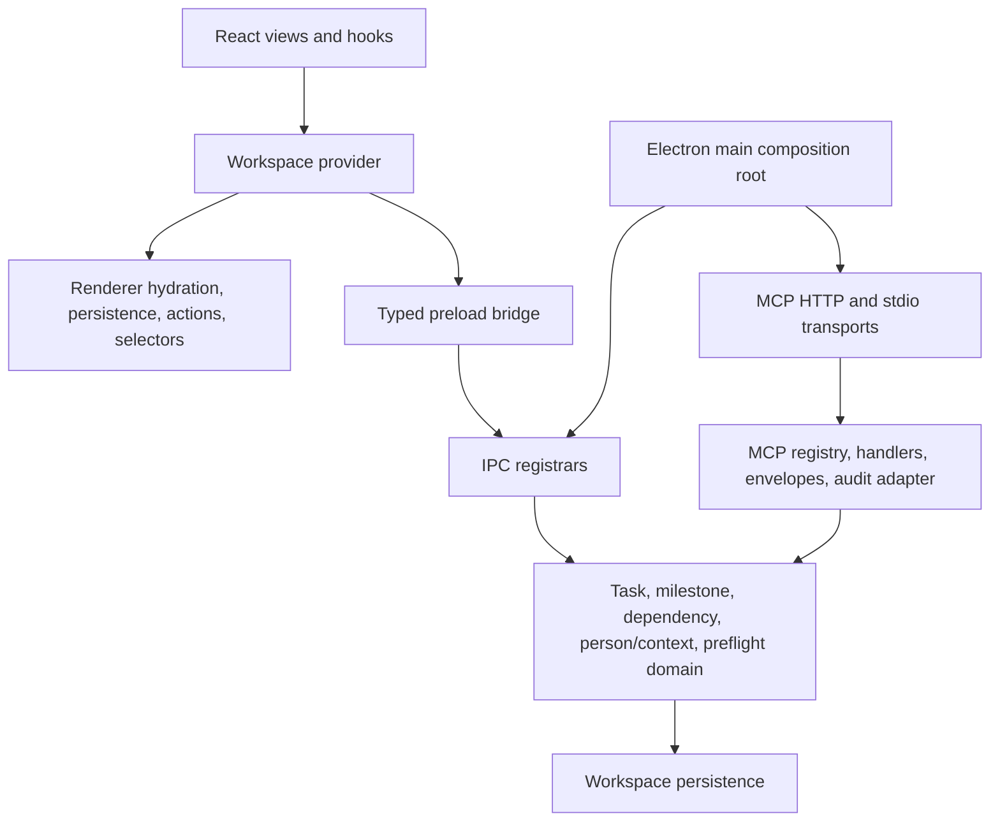

# Domain Service and Protocol Contract Baseline

Status: characterized  
Baseline date: 2026-07-29  
Task: `task-be9500dd-8155-4a8a-8b23-589262eaf8b9`  
Milestone: `milestone-534be418-46f2-4b00-be39-df71e49fc3e4`

## Decision framing

Omvra remains one Electron deployment, one `electron-store` workspace, and one React workspace provider. The observed problem is mixed ownership inside four large files, not a need for independent deployment, scaling, or fault isolation. The selected structure is therefore a bounded modular monolith with plain modules and existing facades retained during migration.

| Option | Fit | Decision |
| --- | --- | --- |
| Keep the four concentration points intact | Lowest immediate change, but keeps domain rules coupled to adapters and composition | Rejected for the milestone |
| Extract bounded modules behind current contracts | Separates ownership without changing deployment, persistence, or public APIs | Selected |
| Split services or processes | Adds authentication, synchronization, deployment, and operational costs without a demonstrated runtime need | Rejected |

Verified facts:

- `electron/services/workspace-service.cjs` owns task, milestone, person/preflight, MCP configuration/audit/watcher, Goal projection, prompt, and resource behavior.
- `electron/services/mcp-http-server.cjs` owns the MCP registry, aliases, dispatch, envelopes, audit projection, resources/prompts, authentication, and HTTP lifecycle; `electron/scripts/mcp-stdio.cjs` reuses its dispatcher.
- `src/app/store/workspaceStore.tsx` owns the public workspace provider plus canonical hydration, persistence effects, actions, and preferences.
- `electron/main.cjs` is the Electron entry point and composition root, but also registers store, Goal, export, attachment, external-link, and MCP-restart IPC inline.

Constraints:

- Preserve storage keys, `__mcpRevision`, MCP names and envelopes, preload/IPC channels, hydration order, import/export behavior, and visible UI behavior.
- Domain modules must not import MCP, ACP, Electron IPC, React, or renderer state.
- No database, state library, process, plugin framework, or ACP implementation is introduced by this milestone.

## Current callers and compatibility facades

| Current facade | Direct production consumers | Other characterized consumers | Compatibility rule |
| --- | --- | --- | --- |
| `electron/services/workspace-service.cjs` | `mcp-http-server.cjs`, `electron/ipc/mcp.cjs`, `electron/main.cjs` | `workspace-service.test.cjs`, `mcp-fixtures.test.cjs`, `goal-mutation-policy.test.cjs`, `goal-runtime-integration.test.cjs` | Keep its current exports delegating until each consumer moves |
| `electron/services/mcp-http-server.cjs` | `electron/main.cjs`, `electron/scripts/mcp-stdio.cjs` | `mcp-http-server.test.cjs`, `workspace-service.test.cjs`, `goal-runtime-integration.test.cjs`, `src/app/hooks/app-hooks.test.ts` | Keep `startMcpHttpServer` and `createRequestDispatcher` stable |
| `src/app/store/workspaceStore.tsx` | `src/app/App.tsx`, `src/app/hooks/useAppShell.ts`, `src/app/components/MarkdownContent.tsx` | `src/app/hooks/app-hooks.test.ts` | Keep one provider and the existing hook/value contract |
| `electron/main.cjs` | Electron via `package.json#main` | preload and IPC contract tests | Keep app/window lifecycle and composition visible in main |

## Responsibility map

The paths below are destinations for the extraction tasks. A destination is created only when its responsibility is moved; empty scaffolding is not part of this baseline.

| Responsibility | Current owner | Target owner | Known consumers after extraction |
| --- | --- | --- | --- |
| Task normalization, validation, reads, CRUD, assignment, comments, activity, attachments, time, and review transitions | `workspace-service.cjs` | `electron/domain/task-service.cjs` | workspace facade, MCP task handlers, IPC/domain composition, tests |
| Person lookup, assigned-work projection, canonical instruction resolution, and read-only execution preflight | `workspace-service.cjs` | `electron/domain/person-context-service.cjs` | workspace facade, MCP agent/task handlers, future ACP adapter |
| Milestone normalization, CRUD, membership, scheduling, and task-link persistence | `workspace-service.cjs` | `electron/domain/milestone-service.cjs` | workspace facade, MCP milestone handlers, renderer/IPC composition |
| Dependency ID validation, missing-target rejection, cycle checks, and atomic link planning | `workspace-service.cjs` and renderer `workspaceMutations.ts` | `electron/domain/dependency-rules.cjs`; reuse pure renderer helpers only for local UI previews | task and milestone services; renderer must not become a second rule owner |
| MCP tool definitions, public underscore names, and canonical aliases | `mcp-http-server.cjs` | `electron/mcp/tool-registry.cjs` | HTTP and stdio dispatch |
| MCP task, milestone, Goal, workspace, board, skill, prompt, and resource dispatch | `mcp-http-server.cjs` | focused modules under `electron/mcp/handlers/` | shared MCP dispatcher |
| MCP success/error normalization and redacted audit projection | `mcp-http-server.cjs` | `electron/mcp/envelopes.cjs` and `electron/mcp/audit-adapter.cjs` | all MCP handlers and transports |
| HTTP authentication, sessions, request parsing, and server lifecycle | `mcp-http-server.cjs` | retained `mcp-http-server.cjs` transport facade | Electron main |
| Renderer initial reads and canonical-store/localStorage migration | `workspaceStore.tsx` | `src/app/store/workspaceHydration.ts` | workspace provider |
| Renderer persistence effects, pending-write suppression, and external-store synchronization | `workspaceStore.tsx` | `src/app/store/workspacePersistence.ts` | workspace provider |
| Renderer workspace mutations | `workspaceStore.tsx` | reuse `src/app/store/workspaceMutations.ts`; add only missing domain-grouped actions | workspace provider |
| Renderer derived reads | provider consumers and hooks | reuse `src/app/domain/workspaceReadModel.ts`; add pure selectors only when a current consumer needs them | renderer hooks and views |
| MCP IPC | `electron/ipc/mcp.cjs` | retained `electron/ipc/mcp.cjs` | preload MCP bridge |
| Update IPC | `electron/services/update-ipc.cjs` | retained until the IPC task decides whether a path-only move adds value | preload update bridge |
| Store, Goal, attachment/document, export, external-link, and MCP-restart IPC | inline in `electron/main.cjs` | cohesive registrars under `electron/ipc/` | preload bridge |
| App/window lifecycle and service construction | `electron/main.cjs` | retained `electron/main.cjs` composition root | Electron runtime |

Goal lifecycle/state/policy services already exist under `electron/services/`. This milestone must reuse them rather than create parallel Goal domain modules. MCP configuration, board watchers, and current audit storage remain outside task/milestone domain services and move only with the MCP adapter task.

## Allowed dependency direction

Forbidden dependencies:

- `electron/domain/**` → `electron/mcp/**`, `electron/ipc/**`, `electron/main.cjs`, React, `src/app/**`, sockets, or JSON-RPC envelopes.
- `electron/mcp/**` handlers → `electron-store` keys or task/milestone mutation rules; handlers call domain services.
- MCP transport → task or milestone business rules.
- MCP and future ACP adapters → each other.
- `electron/ipc/**` → renderer state or React.
- Renderer hydration/persistence/selectors → MCP server internals.
- `electron/main.cjs` → direct task or milestone mutations after the registrars are composed.
- Any extraction → renamed storage keys, channels, MCP tools, aliases, or changed result/error shapes without an explicit migration task.

## Protected public contracts

The runnable baseline is `electron/services/modularization-contract-baseline.test.cjs`. It protects:

- the exact `workspace-service.cjs` compatibility export surface;
- the exact MCP tool list advertised for the admin profile, including underscore aliases;
- renderer workspace persistence keys and the public provider exports;
- preload invocation channels and parity with registered IPC handlers.

Existing focused behavior checks remain authoritative:

| Contract | Existing checks |
| --- | --- |
| Workspace snapshot and audit shape | `workspace-service.test.cjs` |
| Optimistic revision success and stale-revision failures | `workspace-service.test.cjs` |
| MCP schemas, aliases, denial behavior, envelopes, resources, prompts, HTTP, and stdio-shared dispatch | `mcp-http-server.test.cjs`, `mcp-fixtures.test.cjs` |
| MCP IPC results | `mcp-ipc.test.cjs` |
| Canonical-store-first hydration | `canonical-hydration.test.cjs` |
| Preload event forwarding | `preload-update-bridge.test.cjs` |
| Renderer mutation and backup/import behavior | `workspaceMutations.test.ts`, `workspaceBackup.test.ts` |

Protected renderer persistence keys at this baseline:

- `omvra.tasks.v1`
- `omvra.swimlanes.v1`
- `omvra.people.v1`
- `omvra.milestones.v1`
- `omvra.statusColumns.v1`
- `omvra.preferences.v1`
- `omvra.mcp.agentWatchConfigs.v1`
- `omvra.goalPolicy.v1` through the existing Goal policy utility

`__mcpRevision` remains the optimistic revision field for tasks, milestones, and governed Goal writes. Milestone linking currently increments affected task revisions; callers must re-read before a subsequent revision-checked write.

### MCP protocol and audit envelope

- Public advertised tool names use underscores. `TOOL_NAME_ALIASES` maps them to dot-separated canonical handler names; `task_write` remains the compatibility create path. The exact advertised admin-profile list is executable data in the baseline test.
- Every JSON-RPC response keeps `{ jsonrpc: '2.0', id, result }` or `{ jsonrpc: '2.0', id, error }`.
- Tool results keep `{ structuredContent, content: [{ type: 'text', text }], isError }`.
- Successful writes keep `structuredContent.ok`, `action`, `changed`, `auditId`, and the applicable `revision` plus task, goal, milestone, status, or deletion result fields.
- JSON-RPC error codes remain parse `-32700`, invalid request `-32600`, method not found `-32601`, invalid params `-32602`, internal `-32603`, access disabled `-32001`, unauthorized `-32002`, and write forbidden `-32003`.
- MCP audit records remain bounded and redacted. Stable fields include `auditId`, `timestamp`, `schemaVersion`, `type`, client/transport metadata, safe allow-listed operation details, normalized `outcome`, `failureClass`, `startedAt`, `finishedAt`, `durationMs`, and a normalized target. Payloads and arbitrary request fields are not copied into the audit log.

## Migration and verification sequence

1. Keep all four public facades intact and move one responsibility at a time behind them.
2. Run `npm run test:mcp` after each Electron domain/MCP/IPC move.
3. Run `npm run test:workspace-contracts` after renderer hydration, persistence, action, or selector changes.
4. Run `npm run build` before handoff.
5. Record every facade that still delegates at the integration gate; removal belongs to the post-ACP consolidation milestone unless all consumers have already migrated safely.

Primary risk: a mechanically smaller file split could preserve mixed ownership. Mitigation: move rules by responsibility, keep adapter modules orchestration-only, and use the forbidden-dependency list during review.

Reversal cost is low: the facades remain stable throughout the prerequisite pass, so an extraction can be reverted internally without changing MCP clients, preload consumers, persisted workspaces, or renderer callers.
