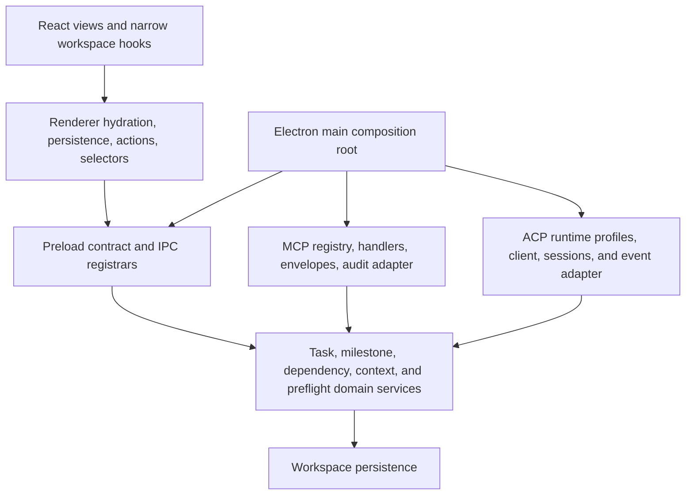

# Domain Service and Protocol Modularization Plan

Status: planned  
Decision date: 2026-07-29  
Projects: Omvra, Omvra Web

## Decision

Use two bounded architecture passes around the Multi-Agent and ACP delivery:

1. Complete a behavior-preserving modularization pass before implementation-heavy Multi-Agent, task-context-ledger, and ACP runtime work.
2. Complete a short consolidation pass immediately after ACP release QA, using the implemented dependency graph as evidence.

Omvra remains one Electron application with one workspace persistence model and one renderer workspace provider. This is a modular-monolith refinement, not a rewrite, a new process boundary, or a new state-management system.

## Why this is needed

The current extension points are concentrated in four files:

| Surface | Measured size | Mixed responsibilities |
| --- | ---: | --- |
| `electron/services/workspace-service.cjs` | 4,037 lines | task and milestone mutations, dependency rules, agent context/preflight, MCP configuration/audit/watchers, Goal projections, prompts, and resources |
| `electron/services/mcp-http-server.cjs` | 3,223 lines | tool definitions and aliases, request dispatch, domain handlers, response envelopes, audit projection, resources, authentication, and transport lifecycle |
| `src/app/store/workspaceStore.tsx` | approximately 825 lines | provider composition, hydration, persistence, preferences, actions, and derived reads |
| `electron/main.cjs` | 709 lines | application/window lifecycle, service composition, update/document behavior, and IPC registration |

Adding collaboration records, a context ledger, composed preflight, ACP subprocess sessions, and provider runtime settings directly to these surfaces would increase duplicate ownership and regression risk. The prerequisite pass creates explicit seams first. The post-ACP pass removes temporary facades and resolves ownership drift after the real integration is known.

## Options considered

### Keep the current files intact

Smallest immediate change, but every new feature would add more branching to already mixed protocol, persistence, and domain responsibilities. Rejected because it transfers cost and risk into the Multi-Agent and ACP milestones.

### Bounded modular monolith

Extract focused domain services and protocol adapters behind current contracts. Preserve storage, tool, IPC, and renderer APIs during migration. Selected because it creates the required seams without distributed-system overhead or speculative abstractions.

### Separate services or processes

Would isolate failures more strongly, but introduces deployment, authentication, synchronization, and operational complexity that ACP v1 does not require. Rejected for now.

## Target dependency direction

Rules:

- Domain services do not import MCP, ACP, Electron IPC, or React.
- MCP and ACP are separate adapters over shared domain contracts; neither adapter calls the other.
- Workspace persistence is reached through domain services for governed mutations.
- Preflight remains read-only until an explicit start action revalidates revision and policy.
- Electron main owns application/window lifecycle and service composition, not domain rules.
- The renderer keeps one provider; extraction separates concerns without introducing another state store.
- Plain modules and service factories are preferred. Stateful classes are reserved for genuine ACP subprocess/session lifecycle.

## Contracts protected during extraction

- Workspace storage keys and backward-compatible loading
- Task and milestone `__mcpRevision` behavior
- MCP tool names, aliases, result/error envelopes, and audit semantics
- Preload and IPC channel names, validation, and failure behavior
- Renderer hydration, persistence ordering, import/export, and restart behavior
- Existing direct assignment, Goal lifecycle, and non-ACP execution paths

Temporary facade exports are allowed only when they keep these contracts stable while callers migrate. Each retained facade must be named in the prerequisite QA evidence and reconsidered in the post-ACP audit.

## Milestone 1: prerequisite modularization

**Omvra Domain Service & Protocol Modularization**  
ID: `milestone-534be418-46f2-4b00-be39-df71e49fc3e4`  
Dates: 2026-07-29 to 2026-08-21

| Order | Task | ID | Depends on |
| ---: | --- | --- | --- |
| 1 | Characterize contracts and record target boundaries | `task-be9500dd-8155-4a8a-8b23-589262eaf8b9` | — |
| 2 | Extract task, person, and execution-preflight domain services | `task-7e2915fc-564b-4c21-a475-43b5c7ac54b5` | 1 |
| 3 | Extract milestone and dependency domain services | `task-ea60fa3e-9578-436f-a71a-0355cab2b995` | 1 |
| 4 | Split MCP registry, handlers, audit adapter, and transport | `task-efebe37d-2243-44cc-8bce-bab92d40491e` | 1, 2, 3 |
| 5 | Split renderer workspace hydration, persistence, actions, and selectors | `task-8a6c0eb5-431c-41dc-bdac-5a2e920f83e0` | 1 |
| 6 | Extract IPC registrars and reduce Electron main to composition | `task-bd70c9fc-53d9-48f4-a458-f12f40a89089` | 2, 3 |
| 7 | Integrate extension points and run regression QA | `task-569f7fe7-2a1a-444d-9d4a-59a149463057` | 2–6 |

Every task includes scoped todos, positive and negative acceptance criteria, and a focused verification obligation. This milestone contains no Multi-Agent or ACP product implementation.

### Downstream gates

Milestone dependencies are represented by task dependencies:

- Multi-Agent task collaboration persistence (`task-fab773be-3020-4c27-aa40-5cb21f22ca44`) depends on the prerequisite QA task.
- Task-context-ledger persistence (`task-4931b24d-d49d-4da5-b31c-7259d6d4bcd7`) depends on the prerequisite QA task.
- ACP runtime profiles/settings (`task-08b61565-e589-4731-bdc5-bd5d3262ab9f`) depends on both its ACP contract and the prerequisite QA task.

Architecture and UX contract tasks may proceed before the gate closes because they do not extend the implementation surfaces.

### Resulting schedule adjustments

- **Omvra Multi-Agent Task Orchestration** now ends on 2026-09-19. Its implementation chain begins after the prerequisite milestone, while architecture and UX-contract work retain their earlier dates.
- The task-context-ledger implementation chain begins on 2026-08-22 and its QA ends on 2026-09-25.
- The ACP milestone retains its 2026-08-18 start because the protocol contract may proceed in parallel, and retains its 2026-10-22 end.

## Milestone 2: post-ACP consolidation

**Omvra Post-ACP Architecture Consolidation**  
ID: `milestone-95f08263-5f1e-4fd8-890b-743121576db3`  
Dates: 2026-10-23 to 2026-11-06

| Order | Task | ID | Depends on |
| ---: | --- | --- | --- |
| 1 | Audit implemented boundaries and dependency graph | `task-b5f23e60-4174-431b-b5a5-d939ed8fb4f6` | ACP release QA |
| 2 | Remove transitional facades and duplicate domain logic | `task-d16a719f-76d6-4689-ae49-4c11906e2dc9` | 1 |
| 3 | Consolidate MCP and ACP adapters, envelopes, and audit projections | `task-578d0c94-cd8b-4b3b-938a-376f5c034ba2` | 1 |
| 4 | Consolidate task, context, preflight, session, and runtime ownership | `task-b723ba8f-974f-48f2-80e1-f9b7be4a2244` | 2, 3 |
| 5 | Slim renderer store, IPC registration, and Electron composition | `task-f6f1e1f6-565e-4c21-bd05-87b2dda97b90` | 2, 3 |
| 6 | Verify cancellation, bounded events, and resource disposal | `task-77f79616-220f-4f4d-9e2a-ff7c921d57fa` | 3 |
| 7 | Finalize architecture record and regression evidence | `task-d36f6ca1-e353-43a2-a82b-b636526c102a` | 4–6 |

The entry task depends on ACP release QA (`task-0e98041c-40d4-4c00-86b7-d9c2022e615e`), making the second pass explicitly post-implementation.

## Completion gates

The prerequisite pass is complete only when:

- protected contracts are characterized and passing;
- task, milestone, dependency, person/context, and preflight rules have one domain owner;
- MCP transport and Electron IPC contain no duplicated task or milestone business rules;
- the renderer provider remains compatible while hydration, persistence, actions, and selectors are separated;
- remaining compatibility facades are documented with a reason and a post-ACP revisit owner.

The post-ACP pass is complete only when:

- the checked-in dependency graph is acyclic at the intended module boundaries;
- MCP and ACP adapters independently pass contract and lifecycle checks;
- cancellation and shutdown do not orphan subprocesses, sessions, streams, listeners, or timers;
- context and event retention remain bounded and redacted under sustained use;
- no watcher or background mechanism can continuously redispatch token-consuming work without a new explicit user action;
- the final architecture record matches the implementation and names any remaining bounded exception.

## Non-goals

- No provider authentication libraries or provider credentials in Omvra
- No remote ACP gateway in the first release
- No generic plugin platform
- No recursive agent hierarchy
- No watcher-triggered ACP execution or automatic runtime relaunch
- No transcript replay as task context
- No new database or renderer state library
- No style-only file splitting without a change in ownership or dependency direction

## Revisit points

Re-open this decision if one of these becomes true:

- ACP must run remotely or across a trust boundary that requires a separate service.
- Workspace persistence can no longer provide required concurrency or retention guarantees.
- A domain module develops independent deployment, scaling, or failure-isolation requirements.
- The post-ACP audit shows a different stable boundary than the one proposed here.

Until then, the smallest safe architecture is a well-bounded modular monolith with protocol adapters at the edges.
