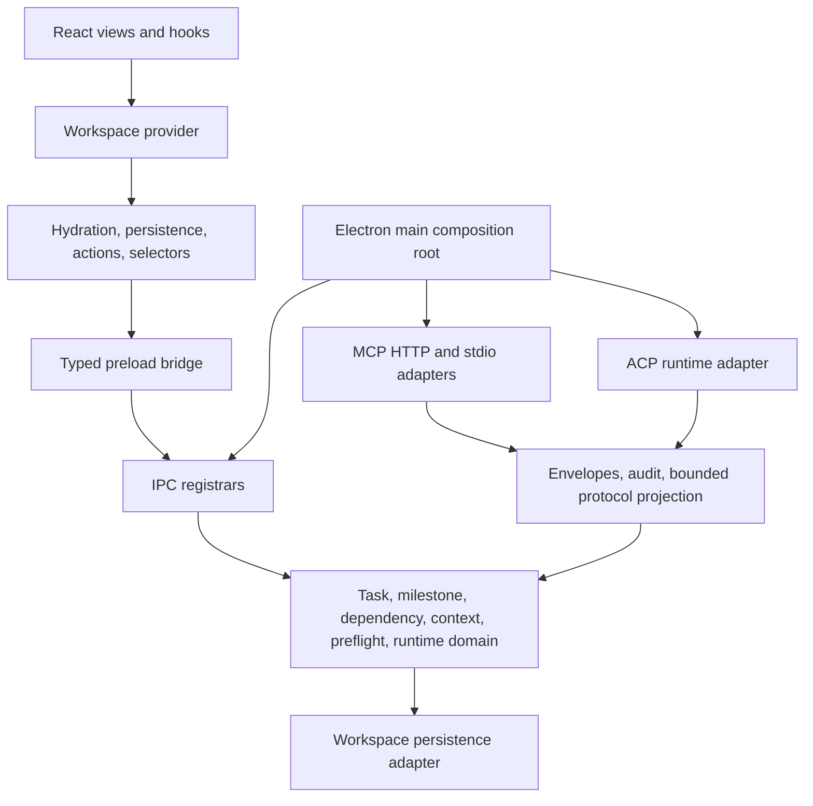

# Post-ACP Architecture Consolidation: Audit and Execution Record

Status: planned follow-on execution record  
Audit task: `task-b5f23e60-4174-431b-b5a5-d939ed8fb4f6`  
Milestone: `milestone-95f08263-5f1e-4fd8-890b-743121576db3`  
Projects: Omvra, Omvra Web  
Audit date: 2026-08-04

## Executive decision

Proceed with a narrow post-ACP consolidation pass. The audit found no dependency cycle, MCP-to-ACP adapter call, domain-to-adapter import, or direct MCP mutation bypass. The follow-on work must therefore remove only demonstrated forwarding, duplicate ownership, or serialization seams. Compatibility exports, protocol separation, lifecycle ownership, and the renderer’s single provider remain protected.

The audit verification passed 36 focused tests with no production files changed. Evidence is recorded on the audit task in activity `activity-2cc91030-9642-412d-b4f9-41b7b701ede4` and context entry `task-context-544fb6af-2834-49fc-80f5-05ae695ffb5f`.

## Findings and decisions

### 1. Workspace service facade: migrate named consumers, then prune

`electron/services/workspace-service.cjs` remains both a compatibility facade and a composition owner. It wires extracted domain services and still supplies characterized task, milestone, context, preflight, session, and MCP-facing exports. `electron/main.cjs` dynamically requires it for `transitionTaskContribution` and `getTaskById`.

Decision: migrate named production consumers to an explicit composition object or direct domain seam before removing an export. Do not delete the facade wholesale. The removal gate is zero supported callers for each removed export, the modularization contract test, and `npm run test:mcp`.

### 2. Persistence: characterize one adapter and retain the web mirror explicitly

Renderer persistence uses `persistJSONWithElectronMirror`, writing localStorage and mirroring to electron-store. Hydration independently mirrors canonical exported values back to localStorage. Electron domain services write electron-store through injected callbacks. This is a deliberate Electron/web compatibility seam, but it creates duplicate serialization paths.

Decision: define one documented persistence adapter/owner for canonical Electron-store writes and keep localStorage only as the explicit web/fallback mirror. Preserve canonical-first hydration, import/export, restart behavior, storage keys, and fallback behavior. Do not introduce a new storage system.

### 3. Normalization: reduce plumbing only where caller inventory proves duplication

Normalization primitives are supplied by `workspace-service.cjs` and passed into multiple factories. Dependency validation is already owned by `electron/domain/dependency-rules.cjs`; task validation is owned by `electron/domain/task-service.cjs`; MCP does not duplicate dependency error rules.

Decision: inventory callers and remove duplicate helper implementations or unnecessary plumbing only when the canonical owner is clear. Preserve exact dependency/cycle, task revision, preflight, error, and write behavior.

### 4. Lifecycle ownership: keep the current separation

Task collaboration transitions belong to `electron/domain/task-collaboration-lifecycle-service.cjs`; ACP session transitions belong to `electron/domain/agent-runtime-session-service.cjs`; Goal lifecycle remains in `electron/services/goal-lifecycle-service.cjs`. The ACP runner calls task-transition and context-pack callbacks but does not own acceptance or Goal state.

Decision: no cleanup is justified without a concrete duplicated transition. The task/context/runtime ownership task should verify this boundary rather than merge it.

### 5. Context, preflight, and session: remove forwarding, preserve owners

`agent-execution-preflight-service.cjs`, `task-context-ledger-service.cjs`, `agent-runtime-context-pack.cjs`, `agent-runtime-session-service.cjs`, and `agent-runtime-session-runner.cjs` form explicit seams. The remaining issue is facade-mediated access, not evidence of mixed lifecycle ownership.

Decision: migrate redundant facade forwarding only after direct consumers are characterized. Preserve selective, source-linked context; bounded 12-entry retrieval; provider-neutral session binding; opaque session state outside durable context; and no transcript persistence.

### 6. MCP and ACP contracts: keep protocol adapters separate

MCP aliases, `task_write`, the workspace `swimlanes` alias, renderer underscore-to-dot aliases, envelopes, audit semantics, and transport/session lifecycle are protected public behavior. No MCP-to-ACP or ACP-to-MCP call was observed.

Decision: consolidate shared domain calls, envelopes, redaction, and audit projection behind common domain contracts, while keeping MCP and ACP transport/session behavior protocol-specific. Compatibility aliases are not cleanup candidates until consumers migrate.

## Verified dependency direction

Forbidden dependencies remain: domain to MCP/ACP/IPC/React; MCP handlers to persistence keys or business rules; MCP to ACP; ACP to MCP; IPC to renderer state; and renderer modules to MCP internals.

## Protected contracts

- Workspace-service compatibility exports until each named consumer migrates.
- MCP public names, aliases, `task_write`, JSON-RPC/tool envelopes, audit redaction, and HTTP/stdio shared dispatch.
- Preload invoke channels and IPC parity.
- Renderer provider exports, hydration order, localStorage fallback, import/export, restart behavior, and canonical keys.
- Task, milestone, and Goal `__mcpRevision` behavior and exact result/error shapes.
- ACP provider-neutral session binding, bounded context pack, provider-owned MCP configuration, explicit launch, and no automatic completion or acceptance.

## Findings-driven work sequence

1. Migrate and inventory workspace-service consumers; remove only unused forwarding exports.
2. Characterize the persistence adapter and explicit web/fallback mirror.
3. Consolidate shared MCP/ACP domain calls, envelopes, redaction, and audit projection without joining transports.
4. Re-check task, context, preflight, runtime, and session ownership; remove only duplicate transitions or facade forwarding.
5. Slim renderer and IPC composition surfaces using existing selectors, actions, hydration, persistence, and registrars.
6. Verify cancellation, shutdown, idempotency, event/context bounds, and resource disposal.
7. Update this record with actual module names, remaining exceptions, and regression evidence.

## Exit evidence

The milestone may close only when the final record names every retained exception and owner, each removed export has zero supported callers, canonical persistence and fallback tests pass, MCP and ACP contracts pass independently, renderer and IPC regressions pass, cancellation/shutdown leaves no orphaned resources, and sustained event/context retention remains bounded and redacted.

No product capability, provider support, storage redesign, generic plugin system, new renderer state system, or style-only file split is authorized by this record.
