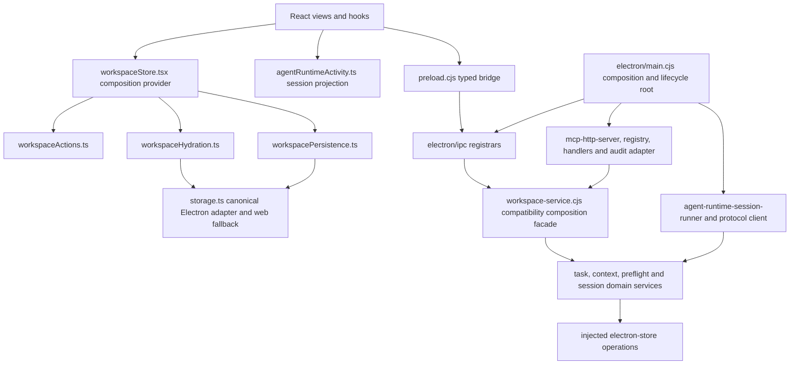

# Post-ACP Architecture Consolidation: Final Record

Status: implemented; ready for human review
Audit task: `task-b5f23e60-4174-431b-b5a5-d939ed8fb4f6`
Final evidence task: `task-d36f6ca1-e353-43a2-a82b-b636526c102a`
Milestone: `milestone-95f08263-5f1e-4fd8-890b-743121576db3`
Finalized: 2026-08-26

## Decision

Omvra remains a modular monolith: one Electron deployment, one canonical `electron-store` workspace in the desktop runtime, one React workspace provider, and separate MCP and ACP adapters over shared domain contracts. The observed problems were internal ownership, forwarding exports, duplicate renderer projection, and lifecycle disposal. None required an independently deployed service, a storage migration, a plugin system, or a second renderer state system.

The post-ACP pass removed demonstrated duplication while preserving public protocol, storage, revision, hydration, and lifecycle contracts.

## Final module map and dependency direction

Allowed direction is renderer → preload → IPC → composition/domain and protocol adapter → shared domain → injected persistence. Forbidden direction remains domain → React/preload/IPC/MCP/ACP, MCP → ACP, ACP → MCP, handler → storage-key/business-rule ownership, or IPC → renderer state.

### Canonical owners

| Concern | Owner | Adapter/consumer boundary |
| --- | --- | --- |
| Task validation, revisions, dependencies | `task-service.cjs`, `dependency-rules.cjs` | workspace facade, MCP, IPC |
| Milestones | `milestone-service.cjs` | workspace facade |
| Collaboration transitions | `task-collaboration-lifecycle-service.cjs` | MCP and ACP runner callbacks |
| Context ledger and bounded preflight projection | `task-context-ledger-service.cjs`, `agent-execution-preflight-service.cjs`, `agent-runtime-context-pack.cjs` | MCP and ACP runner |
| Provider-neutral session bindings and retained events | `agent-runtime-session-service.cjs` | ACP runner and IPC |
| Live provider processes, requests and disposal | `agent-runtime-session-runner.cjs`, `agent-runtime-protocol-client.cjs` | Electron composition root |
| MCP names, envelopes and dispatch | `mcp-registry.cjs`, `mcp-handlers.cjs`, `mcp-response.cjs`, `mcp-http-server.cjs` | HTTP and stdio transports |
| Shared bounded failure/audit projection | `protocol-error.cjs`, `mcp-audit-adapter.cjs` | MCP and ACP projections; transports remain separate |
| Renderer session display state | `agentRuntimeActivity.ts#projectAgentRuntimeSession` | supervisor and task execution UI |
| Renderer workspace persistence | `workspacePersistence.ts` through `persistJSONBatchWithElectronMirror` | `workspaceHydration.ts` reads canonical-first |
| Electron IPC and shutdown | `electron/main.cjs` plus `electron/ipc/*.cjs` registrars | preload channels and process lifecycle |

## Implemented consolidation

- Removed 21 unsupported `workspace-service.cjs` exports: duplicated constants, private audit/storage keys, `getMcpAccessTokenStatus`, and `resolveGoalAgentDispatch`. Tests now consume the canonical read models instead of private facade helpers.
- Kept five characterized compatibility constants (`MCP_TASK_REV_FIELD`, review status ID, session binding/event keys, and contribution-attempt key) plus supported operation exports. The exact surface is locked by `modularization-contract-baseline.test.cjs`.
- Kept lifecycle ownership separate: collaboration, task context, preflight, session persistence, live runtime process state, and Goal lifecycle each retain one owner.
- Made the task-context ledger the source of its own storage key and added provider-switch coverage proving a fresh session starts from the same durable checkpoint.
- Centralized renderer status derivation in `projectAgentRuntimeSession`; the supervisor and task execution surface no longer reconstruct parallel state machines.
- Narrowed runtime-event refreshes to the affected binding/task, retained the 10-second recovery poll, and narrowed Markdown preference subscription to its selected value.
- Documented `workspacePersistence.ts` as the only renderer workspace-write owner. Electron-store is canonical on desktop; localStorage is a browser/failure fallback mirror.
- Added idempotent runtime-runner disposal. Electron `before-quit` clears reconciliation, disposes live clients/subscriptions/timers/requests, reconciles bindings to `interrupted/app-shutdown`, then closes MCP/update resources.
- Verified stored runtime events retain only the latest 2,000 entries and MCP audit persistence uses an exact field allow-list.
- Archived the removed Codex watcher handoff proposal. There is no current watcher runtime or `agent.handoffs.*` contract.

## Retained exceptions and revisit triggers

| Exception | Owner and boundary | Risk | Revisit trigger |
| --- | --- | --- | --- |
| `workspace-service.cjs` remains a compatibility/composition facade for main, MCP and tests | Electron/domain maintainers; exact exports are contract-tested | A broad facade can hide ownership drift | Remove one export only after its supported caller count reaches zero and MCP/workspace contracts pass |
| Five compatibility constants remain re-exported by the workspace facade | Domain owners; values remain stable public/test seams | Duplicate access path | Move a constant when all consumers import its canonical module without a compatibility break |
| localStorage remains a best-effort web/failure mirror | Renderer persistence owner; electron-store stays canonical in Electron | Mirror drift or stale bootstrap data | Revisit if a supported browser runtime is removed/added, canonical-first hydration fails, or storage redesign is separately approved |
| Concurrent local and external writes to the same workspace array remain last-writer-wins | Renderer persistence and main store bridge | A same-key overlapping edit can clobber the other writer; the integration test records this explicitly | Revisit on a reproduced user-data conflict or an approved multi-writer merge/versioning requirement |
| Hot array keys still use full read-modify-write and are not indexed | Workspace storage owner | Growth can increase serialization and IPC cost | Revisit with measured size/latency evidence or an approved storage-architecture milestone; do not swap engines as cleanup |
| `milestone-service.cjs` has no colocated focused test | Milestone domain owner; behavior is covered through workspace/MCP product flows | Failures localize less precisely | Add a focused test with the next milestone-domain behavior change or first uncovered regression |
| The main process retains one raw renderer-diagnostic listener | Electron composition owner; all invoke channels use registrars | A second raw channel could restart IPC sprawl | Extract a registrar if another diagnostic channel is added or the listener gains domain behavior |
| The supervisor retains a 10-second recovery poll in addition to event-driven refresh | Renderer runtime supervision owner | Background IPC reads | Remove only after reliable delivery/reconnect evidence shows polling is unnecessary |
| Provider resume/close remains capability-dependent | ACP adapter owner; unsupported capabilities fail explicitly | Some providers require a fresh session | Revisit only when the provider advertises and implements the capability; never emulate silently |
| `TaskExecutionAction.tsx` remains large, although shared session projection moved out | Renderer task-execution owner | Lower locality for future changes | Split only when the next behavior change demonstrates another reusable owner; no style-only extraction |

These exceptions are bounded and do not hide required work for this milestone. The storage/performance items are separate product architecture decisions, not incomplete ACP cleanup.

## Protected compatibility contracts

- MCP dotted names and underscore aliases, `task_write`, capability profiles, result/error envelopes, HTTP/stdio shared registry, scoped grants, and audit redaction.
- ACP provider-neutral bindings, explicit start confirmation, bounded context, native capability negotiation, cancellation, permission/input requests, and no transcript persistence.
- Preload invoke channels and registered IPC parity.
- Renderer provider exports, canonical keys, hydration order, localStorage fallback, external synchronization, import/export, backup, and restart behavior.
- Task, milestone, Goal and runtime `__mcpRevision`/revision semantics and existing result shapes.
- One Electron app, one workspace model, one renderer provider, and separate MCP/ACP transport lifecycles.

## Regression evidence

Run on 2026-08-26 from the final checked-in implementation plus this documentation reconciliation:

| Gate | Result | Coverage |
| --- | --- | --- |
| `npm run test:workspace-contracts` | 303 MCP/Electron passed; 52 renderer/product-flow passed; 2 intentionally skipped removed-watcher tests | domain ownership, facade surface, acyclic boundaries, MCP, IPC parity, persistence, restart, backup, external sync, renderer projection |
| Focused independent MCP matrix | 81 passed, 0 failed | registry/aliases, handlers, HTTP/stdio, auth/scoped grants, envelopes, audit privacy, IPC |
| Focused independent ACP matrix | 82 passed, 0 failed | preflight, context, profiles, MCP grants, protocol clients, Goal/task sessions, provider switching, cancellation and shutdown disposal |
| Runtime shutdown/retention audit | 110 passed, 0 failed | live-resource disposal, listener/timer/request cleanup, 2,000-event cap, exact audit allow-list |
| `npm run build` | passed | production renderer bundle |
| `node --check` and `git diff --check` | passed | changed CommonJS syntax and patch hygiene |

The two skipped hook tests are executable tombstones for the removed watcher runtime, not unverified current behavior. Browser automation was not required because this pass did not add or alter a user-facing interaction; renderer product-flow contracts and the production build cover the affected UI boundary.

## Scope confirmation

No task in this consolidation added product capability, provider support, a storage engine, a generic plugin system, a second process/deployment, or a new renderer state system. The chosen modular-monolith structure is the smallest architecture that satisfies the verified ownership and lifecycle requirements. Service decomposition was rejected because there is no independent deployment, scaling, fault-isolation, or team-ownership driver; reversing that decision later would require explicit data ownership and operational boundaries, not another facade split.
