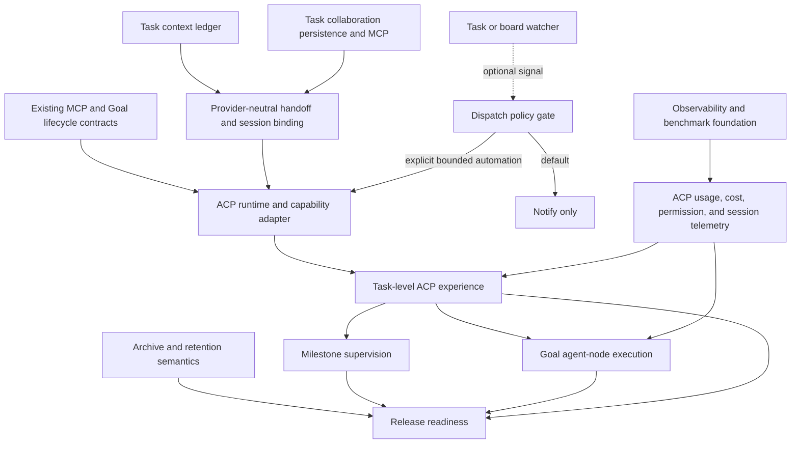

# Provider-neutral agent collaboration through ACP

Status: business need and dependency assessment, 2026-07-28

## Business need

Omvra should let a person supervise agents from different providers, including Codex and Claude, from the task, milestone, and workflow where the work belongs. Users should not need to move between unrelated chat or CLI interfaces to understand which agent is working, what it is doing, what it needs, how much context or cost it has consumed, and whether its output has been accepted.

The durable work record must remain usable when an agent session ends or the provider changes. Omvra therefore needs a provider-neutral interaction layer for live agent sessions while retaining its existing task, milestone, Goal, evidence, policy, and MCP records as the source of truth.

## Desired business outcome

A user can choose an eligible external agent for a bounded piece of work, observe and steer it inside Omvra, and hand the work to another provider without replaying the complete conversation. Omvra preserves the decisions, evidence, context checkpoints, approvals, and lifecycle state needed to continue safely.

This should produce five outcomes:

1. **Provider choice:** users can use different ACP-compatible agents without giving each provider a separate Omvra integration or project history.
2. **Shared supervision:** live agent progress, tool activity, permission requests, blockers, context pressure, and reported cost appear in one product surface.
3. **Portable context:** agents receive bounded, task-relevant context and retrieve older history selectively instead of inheriting an indefinitely growing transcript.
4. **Durable accountability:** agent session completion cannot bypass Omvra evidence, review, dependency, or acceptance rules.
5. **Controlled execution:** Omvra can apply policy limits and stop or escalate work even though authentication and billing remain with the external provider.

## Product boundary

ACP and MCP solve different parts of this need:

| Layer | Responsibility |
| --- | --- |
| External provider or agent | Authentication, billing, model behavior, provider-native tools, and restoration of provider-owned session state |
| ACP | Create, configure, resume, stream, steer, elicit input from, cancel, and close live agent sessions where supported |
| Omvra MCP | Give agents revision-protected access to tasks, milestones, Goals, evidence, and targeted historical context |
| Omvra | Own work identity, lifecycle, dependencies, collaboration roles, policy, context checkpoints, evidence, acceptance, and audit history |

ACP must not become a second task database or workflow engine. An ACP plan is temporary execution progress. An ACP session ending is not task completion, contributor acceptance, Goal completion, or delivery acceptance.

## Agent runtime selection and authentication boundary

Omvra must keep three identities separate:

| Concept | Example | Meaning |
| --- | --- | --- |
| Omvra agent identity | PM agent, engineer, reviewer | The accountable persona, instructions, assignment, and collaboration role |
| Agent runtime | Codex, Claude Code, Kimi, or a verified adapter | The installed application or executable that performs the work |
| Model provider | OpenAI, Anthropic, or another service | The service that owns model access, authentication, billing, and provider limits |

Selecting an Omvra agent does not implicitly select an execution runtime. Omvra settings must allow a user to choose the exact installed runtime so that multiple tools from the same or different providers cannot be confused.

Runtime selection resolves in this order:

1. explicit selection for the task execution or Goal node;
2. project default runtime;
3. Omvra global default runtime.

Omvra must show the resolved runtime before starting work. It must not silently fall back to another installed runtime when the selected runtime is missing, incompatible, signed out, or unavailable, because doing so may change capabilities, account, billing, or policy behavior.

### Minimal local runtime profile

The first implementation stores only the configuration required to address and launch an installed agent:

- stable runtime profile ID and user-facing name;
- integration mode: external handoff or ACP;
- exact executable or approved application link handler;
- fixed launch arguments and local ACP transport when applicable;
- enabled state and optional global or project-default binding;
- last observed adapter version, ACP capabilities, availability, and authentication state.

Version, capabilities, availability, and authentication state are runtime observations, not user-authored promises. They must be refreshed during connection preflight. Provider tokens, cookies, API keys, refresh tokens, and provider account credentials are never stored in the workspace or runtime profile.

The first ACP implementation is local subprocess over stdio. Remote agents, hosted gateways, provider SDKs, embedded OAuth flows, and arbitrary runtime plugins are deferred until a concrete requirement justifies their security and operational cost.

### Connection and authentication behavior

A **Test connection** action launches the exact configured adapter, performs ACP initialization and capability/authentication discovery, reports the result, and terminates without creating a session or starting a model turn. A successful executable lookup alone does not establish ACP compatibility.

Authentication remains agent-managed. If the selected runtime is already authenticated, Omvra reuses that runtime state indirectly. If authentication is required, Omvra surfaces the runtime's ACP authentication method or an agent-native sign-in instruction. Omvra does not import OpenAI, Anthropic, or other provider authentication libraries and does not receive provider credentials.

Local launch behavior must:

- require an explicit user action;
- use an exact resolved executable and argument array without shell interpolation;
- validate the workspace directory and pass only the intended task context;
- allowlist supported external URL schemes;
- keep agent permission prompts enabled;
- avoid background retries, automatic relaunch, or automatic provider failover.

### External handoff fallback

Every configured runtime may expose **Open externally** when it has a safe native handoff but ACP is unavailable or unnecessary. The handoff opens the selected application with the workspace and a bounded task prompt or task-context reference. Where the external application supports it, the prompt remains unsent for human review.

An external handoff records only that Omvra prepared and opened the work. It does not create an ACP session, prove that a model turn started, or advance task lifecycle state. No provider usage should be attributed until the external runtime reports it through a later governed integration.

## Required product capabilities

### Task

- Start or connect an ACP session from a task or contributor assignment.
- Bind the session to a provider, implementation, agent profile, task revision, contribution, and execution attempt.
- Pass the Omvra MCP server and a bounded task context projection into the session.
- Show normalized live messages, plan updates, tool activity, diffs, permission requests, input requests, usage, and reported cost when supported.
- Let the user or orchestrator steer, cancel, resume, or close the session.
- Convert useful outcomes into source-linked evidence, decisions, blockers, handoffs, and context checkpoints rather than persisting an unlimited transcript.
- Keep contributor submission, orchestrator review, human acceptance, and task completion as separate durable transitions.

### Milestone

- Aggregate the state of task-scoped agent sessions without creating one milestone-sized conversation.
- Show active providers, blockers, dependency gates, needs-input states, submitted or accepted contributions, context pressure, and available usage data.
- Allow a milestone coordinator to navigate to, start, or steer eligible task sessions.
- Keep milestone dependencies and completion derived from durable task state, not from agent-reported plans.

### Goal or workflow

- Bind each agent-node execution attempt to one ACP session.
- Keep graph validation, acknowledgement, dispatch, retry, pause, evidence, acceptance, and terminal delivery under the governed Goal lifecycle.
- Map structured ACP elicitation to human-input nodes when supported, with an Omvra-native fallback.
- Treat parallel nodes as separate sessions and allow join behavior only after required durable outputs are accepted.
- Reuse or replace a provider session according to policy without losing the Omvra execution attempt and evidence history.

## To-be process

1. A user, workflow, or orchestrator selects an eligible agent for a task contribution or Goal node.
2. Omvra checks work eligibility, dependencies, permissions, provider availability, and execution budget.
3. Omvra creates an execution attempt and binds an ACP session to it.
4. The agent receives the current work projection, latest accepted checkpoint, a bounded history index, and Omvra MCP access.
5. ACP carries live interaction while MCP carries governed reads and writes.
6. Omvra records normalized session metadata and redacted audit events without raw prompts, responses, tool payloads, or hidden reasoning.
7. The agent submits structured evidence and a handoff checkpoint.
8. The orchestrator or required human reviewer accepts, rejects, or requests revision.
9. Accepted context becomes available to downstream tasks or nodes. A different provider starts with the bounded Omvra context pack rather than the previous provider's full transcript.
10. Omvra closes or retains the external session according to retention policy while keeping the durable work history.

## Dependency model

### Direct prerequisites

| Dependency | Why it is required | Current evidence |
| --- | --- | --- |
| Task context ledger | Provides bounded, source-linked, provider-portable context and prevents full-transcript handoffs | Minimal architecture specification exists; no matching live Omvra task or milestone was found |
| Task collaboration persistence and MCP | Gives every session a durable orchestrator, contributor, scope, status, and evidence owner | Open inside **Omvra Multi-Agent Task Orchestration** |
| Orchestration lifecycle and contributor handoffs | Separates live session activity from submission, revision, acceptance, and aggregate completion | Open inside **Omvra Multi-Agent Task Orchestration** |
| Provider-neutral session binding | Correlates provider session IDs with Omvra task, contribution, Goal node, execution attempt, revisions, and capabilities | New ACP-specific contract; not currently represented by a live task or milestone |
| ACP client runtime and capability adapter | Starts or connects agents, negotiates optional features, passes MCP configuration, and normalizes updates | New ACP-specific capability; not currently represented by a live task or milestone |

The context ledger should precede production cross-provider handoffs. A user-invoked ACP prototype can be built without it, but the prototype would still depend on provider transcripts and would not prove the intended context or portability benefit.

### Watcher boundary and loop prevention

A task or board watcher is not an ACP prerequisite and must not directly start an agent. It detects a change and produces a passive signal. The default outcome is a notification or work-available indicator.

Only a separately configured automation policy may promote that signal into an execution request. Before dispatch, Omvra must confirm that:

- automatic dispatch is explicitly enabled for the task, workflow, or watched status;
- the event type is eligible and was not produced by the same agent execution;
- no execution attempt is already active for the same contribution;
- the watcher event has not already been handled;
- cooldown, attempt, concurrency, token, and cost limits permit execution;
- the task still satisfies dependency, status, permission, and acceptance rules.

Agent-authored task writes, task-context entries, audit events, session status updates, and delivery acknowledgements must not recursively create new work for the execution that produced them. A relevant human change during active work should normally steer or pause the existing session rather than create another session.

The required invariant is:

`watcher event != execution request != task completion`

## Influence on the current Omvra roadmap

This table reflects the live Omvra roadmap read on 2026-07-28.

| Milestone or work item | Live state | ACP influence | Recommended treatment |
| --- | --- | --- | --- |
| **Omvra Multi-Agent Task Orchestration** (`milestone-bfb6fc5e-4915-4c43-ad87-c3980fee58bc`) | 8 linked tasks open | **Critical, direct dependency.** Its collaboration records become the durable owners of ACP sessions and submissions. | Add session-binding compatibility to the architecture before persistence and lifecycle implementation. Make the context ledger a prerequisite for cross-provider handoff behavior. Do not make ACP availability trigger automatic spawning. |
| **Omvra Goals & Loops Workspace** (`milestone-35902469-6814-451b-b7aa-99f56705ace6`) | 22 linked tasks done; QA and scheduled-resilience tasks open | **High.** Agent nodes are the natural workflow scope for ACP sessions; existing policy, evidence, retry, and delivery contracts remain authoritative. | Complete the existing lifecycle QA boundary, then add ACP as an execution adapter. Do not encode ACP sessions into the editable graph or use ACP plans as Goal state. |
| **Omvra MCP Observability & Agent Benchmarking** (`milestone-73f74e74-be2f-4620-8370-45e3389ad1cf`) | Completed and live | **High foundation, not a blocker for discovery.** Its privacy and provenance rules should be reused for ACP telemetry. | Extend the live foundation with a correlated ACP session-event stream rather than overloading MCP tool-call events. Preserve missing-versus-zero semantics for tokens and cost, and benchmark providers separately under controlled conditions. |
| **Unified Codex watcher handoff** (`task-5bd3a967-8710-4d6d-b97a-f7d0b9855b1d`) | In progress; not linked to an ACP milestone | **Optional and deferred.** Its dedupe, claim, lease, and acknowledgement concepts may support later automation, but watcher detection must not directly dispatch ACP work. | Default watcher output to notification only. Put an explicit policy gate between detection and execution, suppress self-authored causal chains, enforce one active attempt, and apply bounded attempt, concurrency, token, cost, and cooldown limits. It is not an ACP prerequisite. |
| **Omvra Quick Actions & Orchestration Controls** (`milestone-958d2937-c3a6-456a-bf8b-e1a4a327568b`) | 5 open tasks plus one task in a custom status | **Medium.** Later commands could start, resume, open, cancel, or inspect an agent session. | Keep the current typed command scope stable. Add ACP actions only after the session contract and permission rules exist; Quick Actions must not become the execution authority. |
| **Archiving** (`milestone-d9fc4816-d8b2-4395-bc88-0ff14c4aad15`) | 2 in progress and 4 open tasks | **Medium release dependency.** Archived tasks and milestones need clear treatment for live sessions, context ledgers, evidence, usage history, and restoration. | Define that archive blocks or closes active attempts, preserves context/evidence/session references, and keeps historical MCP reads available. Reuse its backup and restore path for context-ledger and session metadata. |
| **Omvra Architecture Overhaul** and **UI 2.0 Release** | Linked work marked done | **Enablers.** Shared state and UI primitives reduce integration cost. | Reuse existing domain, persistence, inspector, and status surfaces; do not create a second ACP-specific application shell. |

### Other affected feature areas

- **Agent profiles and configuration:** keep persona and assignment separate from the resolved runtime profile. Settings own global and project runtime defaults; an execution may apply an explicit override. Capabilities, availability, and authentication state are discovered from the selected runtime, and secrets remain provider-owned.
- **Comments with Markdown:** useful for rendering agent-authored summaries and handoffs, but not a prerequisite. Markdown must remain untrusted presentation content rather than executable instructions.
- **Backup and restore:** must preserve task context entries, session bindings, correlation IDs, evidence, and policy history without provider credentials or raw transcripts.
- **Permissions:** ACP permission requests cover immediate tool consent. Omvra approval gates still govern scope changes, credentials, acceptance, destructive operations, and budget widening.
- **Reporting:** session and provider metadata can improve milestone reporting, but missing provider usage must remain `unknown` instead of being reported as zero.

## Recommended delivery sequence

### Phase 0: align contracts

1. Approve this business boundary.
2. Implement the task context ledger persistence and MCP projection.
3. Amend the multi-agent architecture so contributions and execution attempts can reference provider-neutral sessions.
4. Define the local runtime profile, deterministic selection order, provider-owned authentication boundary, and external-handoff audit event.

### Phase 1: prove the task experience

1. Configure one exact local agent runtime from Omvra settings without provider credentials.
2. Provide connection testing and a user-initiated **Open externally** fallback.
3. Implement a minimal local-stdio ACP client for that runtime and bind one ACP session to one task execution attempt.
4. Pass Omvra MCP and the bounded context pack into the session.
5. Show live progress, permissions, cancellation, capability gaps, context usage, and optional reported cost.
6. Persist a structured checkpoint and evidence, then verify that task completion still requires the existing acceptance path.

### Phase 2: prove portability

1. Add a second provider or adapter.
2. Start a fresh session from the same accepted Omvra checkpoint rather than replaying the first transcript.
3. Compare context consumed, human interventions, scope adherence, evidence quality, rework, and reported cost under controlled conditions.

### Phase 3: extend scope

1. Add milestone aggregation over task sessions.
2. Bind Goal agent-node attempts to ACP sessions.
3. Map elicitation, retry, pause, cancellation, and delivery handoff to existing Goal governance.
4. Add Quick Actions only after the underlying session operations and permission checks are stable.
5. Complete archive, restore, retention, and release QA behavior.

### Phase 4: consider bounded watcher automation

1. Keep passive watcher notifications as the default.
2. Define eligible human or system trigger types and propagate source actor, execution attempt, and causation identity.
3. Add explicit opt-in, one-active-attempt enforcement, deduplication, cooldown, and budget checks.
4. Route eligible events through the same governed dispatch path used by manual and workflow execution.
5. Verify that agent-authored writes and context checkpoints cannot trigger another execution.

## Governance and cost-control requirements

- Omvra records provider, agent implementation, model or mode when reported, capabilities, scope identity, revisions, timestamps, and outcomes for every execution attempt.
- Omvra resolves the exact runtime before execution and never silently substitutes another installed runtime.
- Provider authentication and credentials are not copied into workspace records.
- Connection testing does not create a session or model turn. External handoff does not count as execution until independently acknowledged.
- ACP capabilities are negotiated; unsupported controls are hidden or shown as unavailable rather than simulated.
- Provider-reported token, context, and cost data is labelled as reported and optional. Unknown values remain unknown.
- Omvra budgets may limit wall time, turns, tool calls, concurrency, attempts, reported tokens, or reported cost and may pause or cancel work at a threshold. These controls do not guarantee the provider's final bill.
- Raw prompts, responses, tool payloads, private provider state, and hidden reasoning are not persisted in audit or task context records.
- Agent-authored checkpoints cannot represent human approval or acceptance.
- Watcher signals do not authorize execution. Automatic dispatch is opt-in and must pass causal-loop, active-attempt, permission, and budget gates.
- Events caused by an execution cannot re-dispatch that same execution or create an unbounded descendant chain.
- Closing or losing an ACP session cannot complete, delete, or silently abandon the associated Omvra work item.

## Success measures

- A user can configure and test one exact installed runtime without giving Omvra provider credentials.
- A task, project, or global default resolves to one visible runtime, and an unavailable runtime fails explicitly rather than silently switching providers.
- A user can open a bounded task handoff in the selected external application without Omvra sending the prompt automatically where the application supports review-before-send.
- A task can move between two providers using an Omvra checkpoint without copying the earlier full transcript.
- A user can identify the responsible provider, live state, blocker, last durable outcome, and acceptance state from the task or milestone.
- Workflow dependencies do not advance from an ACP plan or stopped session alone.
- Context and cost are visible when reported, with unsupported data clearly identified.
- Provider switching does not weaken task revision protection, Goal policy, evidence, human gates, or audit privacy.
- Controlled benchmarks measure each provider against its own baseline and do not create a misleading cross-provider leaderboard.

## Non-goals

- Replacing MCP with ACP.
- Implementing OpenAI, Anthropic, or other provider authentication libraries in Omvra.
- Storing provider credentials or acting as an identity or billing proxy.
- Treating every installed AI application as ACP-compatible without a successful protocol preflight.
- Silently failing over between installed agent runtimes.
- Treating external agents as behaviorally interchangeable.
- Persisting complete provider conversations as Omvra task history.
- Building recursive autonomous agent trees in the first release.
- Guaranteeing provider billing limits through ACP.
- Supporting every ACP agent or optional capability in the first release.
- Making milestones into long-running shared chat sessions.
- Automatically starting an agent merely because a watched task changed.

## Assumptions and unknowns

### Supported by current evidence

- Omvra already has revision-protected MCP task operations, governed Goal lifecycle and policy records, redacted MCP observability, and architecture proposals for context ledgers, collaboration, and durable watcher handoffs.
- ACP is designed to compose with MCP and provides a provider-neutral client/agent session protocol, while individual agent implementations expose different optional capabilities.

### Inferences to validate

- Existing Electron main-process service boundaries can host the ACP client/runtime without a separate service.
- The current Goal policy resolver can enforce ACP session budgets once normalized usage and lifecycle events are supplied.
- Provider adapters expose enough stable identity and session restoration behavior for reliable correlation.

### Open decisions

- Which provider is the first implementation and which second provider proves portability.
- Which external applications provide a safe review-before-send handoff and which require a terminal-only fallback.
- Whether the first settings surface permits only curated runtime definitions or also accepts a manually selected executable under the same launch restrictions.
- Whether session metadata belongs in a new versioned workspace record or extends an existing execution record.
- Retention duration for closed provider session references and normalized ACP events.
- Whether reported cost is sufficient for hard-stop policy or only warning and confirmation thresholds.
- Whether archived work may retain resumable provider sessions or only durable Omvra checkpoints.
- Which narrowly defined event types, if any, may become opt-in automatic dispatch triggers after the manual ACP path is proven.

## References

- `docs/architecture/task-context-ledger.md`
- `docs/architecture/task-orchestration-and-multi-agent-collaboration.md`
- `docs/architecture/codex-watcher-handoff.md`
- `docs/architecture/goals-control-flow-nodes.md`
- `docs/architecture/mcp-observability-event-contract.md`
- `docs/architecture/mcp-agent-benchmark-protocol.md`
- `specs/goals-loops-operating-model.md`
- `specs/omvra-archiving-prd.md`
- ACP architecture: https://agentclientprotocol.com/get-started/architecture
- ACP agents: https://agentclientprotocol.com/get-started/agents
- ACP v1 overview: https://agentclientprotocol.com/protocol/v1/overview
- ACP initialization: https://agentclientprotocol.com/protocol/v1/initialization
- ACP authentication: https://agentclientprotocol.com/protocol/v1/authentication
- ACP session setup: https://agentclientprotocol.com/protocol/v1/session-setup
- ACP session usage: https://agentclientprotocol.com/announcements/session-usage-stabilized
- Codex desktop deep links: https://learn.chatgpt.com/docs/reference/commands#deep-links
- Claude Code CLI: https://docs.anthropic.com/en/docs/claude-code/cli-usage
